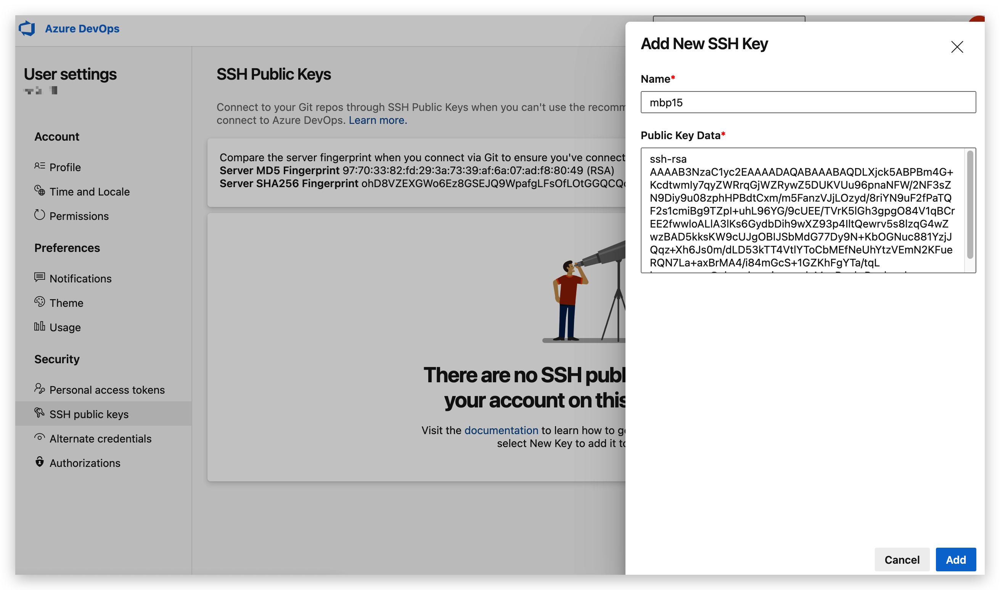

<!--truncate-->


## 1、介绍

`Azure DevOps`是由微软开发的服务平台，它提供了多种工具，可用于更好地进行团队协作。它还具有用于自动构建过程，测试，版本控制和程序包管理的工具

`Azure DevOps`提供了`5`个主要模块

- Azure Boards：敏捷工具
- Azure Repos：无限的、云托管的私人和公共`Git` 库
- Azure Pipelines：构建流水线
- Azure Test Plans：测试工具
- Azure Artifacts： 制品包存档

除此之外，在扩展市场还有超过`1,000`个应用和工具可供选择，这点和自家产品`VS Code`一样，有着非常强大的插件生态

## 2、服务开通
主要步骤如下
- 访问`dev.azure.com`
- 点击“免费开始使用”
- 使用`Microsoft`帐户或`Github`帐户登录(从`2018`年的某一天起，`Github`也是微软自家的了)
- 创建一个`organization`（组织）
- 创建一个`project`（项目）


## 3、添加ssh key

依次点击`User settings` —> `Security` —> `SSH Public Keys` —> `New key`，输入本地的`git ssh`公钥



## 4、测试项目

### 4.1 提交代码

提交测试代码，从`github`克隆并手动推送到到`azure devops repo`上

当然，也可以直接导入`github`项目到`azure devops`界面，这里记录的是提交代码过程

```shell
➜  git clone https://github.com/MicrosoftDocs/pipelines-java && cd pipelines-java
Cloning into 'pipelines-java'...
remote: Enumerating objects: 107, done.
remote: Total 107 (delta 0), reused 0 (delta 0), pack-reused 107
Receiving objects: 100% (107/107), 73.86 KiB | 134.00 KiB/s, done.
Resolving deltas: 100% (38/38), done.
➜  git:(master) git remote add azure git@ssh.dev.azure.com:v3/ssgeek/test-project/test-project
➜  git:(master) git push -u azure --all
```


### 4.2 创建pipeline

创建第一个`pipeline`管道

- 登录到`Azure DevOps`组织，并导航到项目

- 转到`pipeline`，然后选择"新建`Create Pipeline`

- 选择`Azure Repos Git`作为源代码位置，进一步选择刚才创建的`test-project`这个仓库

配置项目流水线类型`Configure your pipeline`，这里识别出了是`java`库，可选择的类型有四种

- Maven类型
- Maven类型并部署到azure cloud上
- 自定义最小化pipeline
- 选择现有的 Azure Pipelines YAML 文件

由于仓库中没有`pipeline`文件，这里选择自动生成一个`pipeline`文件

自动生成的`pipeline`文件内容如下

```yaml
# Maven
# Build your Java project and run tests with Apache Maven.
# Add steps that analyze code, save build artifacts, deploy, and more:
# https://docs.microsoft.com/azure/devops/pipelines/languages/java

trigger:
- master

pool:
  vmImage: ubuntu-latest

steps:
- task: Maven@3
  inputs:
    mavenPomFile: 'pom.xml'
    mavenOptions: '-Xmx3072m'
    javaHomeOption: 'JDKVersion'
    jdkVersionOption: '1.8'
    jdkArchitectureOption: 'x64'
    publishJUnitResults: true
    testResultsFiles: '**/surefire-reports/TEST-*.xml'
    goals: 'package'
```

点击`Save and run`


查看构建日志


此时是构建失败的，也可以到控制台中查看构建错误提示


从提示可以看出构建失败，在于使用`Azure Pipelines`生成代码或部署，需要至少一个代理`agent`，真正运行构建任务的是代理`agent`，这里并没有购买或授予任何托管用于运行`pipeline`任务的`agent`，可以按照提示的链接[申请免费的Agent](https://aka.ms/azpipelines-parallelism-request)

此代理可以绑定微软云代理，也可以绑定自托管的代理（`Linux`、`Windows`、`macOS`）

申请后过几个小时就可以了，再去修改代码触发运行或者手动运行`pipeline`，成功运行


## 5、服务的部署

构建流程运行完成后，就涉及到服务的部署了

在`azure devops`中，服务部署支持部署到`VM`和`kubernetes`环境

配置目标环境的方法，选择`Pipelines` —> `Environments` —> `Create environments`


以`k8s`资源为例，直接配置连接`azure cloud`的`k8s`，或者用`service account`进行配置通用的`k8s`集群


具体的部署模式可以选择`yaml`部署、`helm`部署、以及`azure devops`支持的`Canary`灰度部署等等

## 6、小结

`azure devops`的模式和`gitlab ci`一样，自身集成了代码库管理和`devops`流水线功能，其运行任务的节点类似`gitlab runner`，是商业化`devops`产品的一大选择

最重要的是，`azure devops Pipelines`一个月有`1800`分钟的免费额度，这个免费并不是付费才能“解锁更多姿势”的那种，足够良心

从个人使用来看，界面足够简约好用

所以综上，如果是想白嫖使用商业的`devops`产品，`azure devops`可以首选

`azure pipeline`的语法和`gitlab ci`语法也非常类似，后面再提及了

See you ~