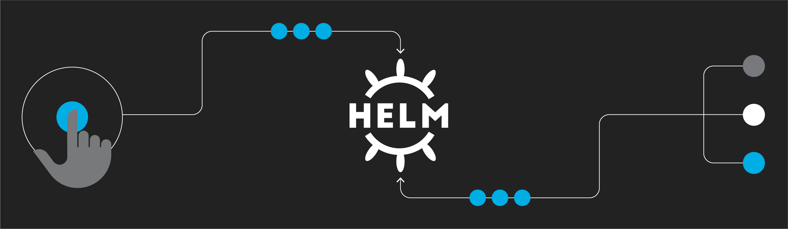

<!--truncate-->


## 1、概述

前面分别写到了 [JenkinsPipeline语法概要](https://www.ssgeek.com/blog/jenkinspipeline-yu-fa-gai-yao) 和 [Dockerfile语法概要](https://www.ssgeek.com/blog/dockerfile-yu-fa-gai-yao)，最近又重新拾起了`Helm Chart`，刚好回忆一下其语法 ~

`Helm`是`k8s`中的一个包管理工具，可以用来部署`k8s`资源。在`Helm`中最核心的就是模板，即模板化的`k8s manifests`文件

它本质上就是一个`Go`的`template`模板。`Helm`在`Go template`模板的基础上，还会增加很多东西。如一些自定义的元数据信息、扩展的库以及一些类似于编程形式的工作流，例如条件语句、管道等等。这些东西都会使得模板变得更加丰富

有了模板，怎么把配置融入进去，用的就是`values.yaml`文件

## 2、调试

`Helm`也提供了`--dry-run --debug`调试参数，帮助验证模板正确性。在执行`helm install`时候带上这两个参数就可以把对应的`values`值和渲染的资源清单打印出来，而不会真正的去部署一个`release`

比如来调试创建的一个`chart`包：

```
# helm install web --dry-run /root/mychart
```

## 3、内置对象

使用 `{{.Release.Name}}`将`release`的名称插入到模板中。这里的`Release`就是`Helm`的内置对象，下面是一些常用的内置对象

| Release.Name      | release 名称                    |
| ----------------- | ------------------------------- |
| Release.Name      | release 名字                    |
| Release.Namespace | release 命名空间                |
| Release.Service   | release 服务的名称              |
| Release.Revision  | release 修订版本号，从1开始累加 |

## 4、Values

`Values`对象是为`Chart`模板提供值，这个对象的值有`4`个来源

- `chart`包中的`values.yaml`文件

- 父`chart`包的`values.yaml`文件

- 通过`helm install`或者`helm upgrade`的 `-f`或者 `--values`参数传入的自定义的`yaml`文件

- 通过 `--set` 参数传入的值

`chart`的`values.yaml`提供的值可以被用户提供的`values`文件覆盖，而该文件同样可以被 `--set`提供的参数所覆盖

编辑`mychart/values.yaml`文件，将默认的值全部清空，然后添加一个副本数

```yaml
# cat values.yaml 
replicas: 3
image: "nginx"
imageTag: "1.17"

# cat templates/deployment.yaml 
apiVersion: apps/v1
kind: Deployment
metadata:
  name: {{ .Release.Name }}-deployment
spec:
  replicas: {{ .Values.replicas }}
  selector:
    matchLabels:
      app: nginx
  template:
    metadata:
      labels:
        app: nginx
    spec:
      containers:
      - image: {{ .Values.image }}:{{ .Values.imageTag }}
        name: nginx
```

查看渲染结果：

```shell
# helm install --dry-run web ../mychart/
```

`values`文件也可以包含结构化内容，例如

```yaml
# cat values.yaml
...
label:
  project: ms
  app: nginx

# cat templates/deployment.yaml
apiVersion: apps/v1
kind: Deployment
metadata:
  name: {{ .Release.Name }}-deployment
spec:
  replicas: {{ .Values.replicas }}
  selector:
    matchLabels:
      project: {{ .Values.label.project }}
      app: {{ .Values.label.app }}
  template:
    metadata:
      labels:
        project: {{ .Values.label.project }}
        app: {{ .Values.label.app }}
    spec:
      containers:
      - image: {{ .Values.image }}:{{ .Values.imageTag }}
        name: nginx
```

查看渲染结果：

```
# helm install --dry-run web ../mychart/
```

## 5、管道与函数

前面讲的相关模块，其实就是将值传给模板引擎进行渲染，模板引擎还支持对拿到数据进行二次处理

例如从`.Values`中读取的值变成字符串，可以使用`quote`函数实现

```yaml
# vi templates/deployment.yaml
app: {{ quote .Values.label.app }}
# helm install --dry-run web ../mychart/
        project: ms
        app: "nginx"
```

`quote .Values.label.app`将后面的值作为参数传递给`quote`函数

模板函数调用语法为：`functionName arg1 arg2...`

另外还会经常使用一个`default`函数，该函数允许在模板中指定默认值，以防止该值被忽略掉

例如忘记定义，执行`helm install`会因为缺少字段无法创建资源，这时就可以定义一个默认值

```yaml
# cat values.yaml
replicas: 2
# cat templates/deployment.yaml
apiVersion: apps/v1
kind: Deployment
metadata:
- name: {{ .Values.name | default "nginx" }}
```

其他常用函数

- 缩进：`{{ .Values.resources | indent 12 }}`

- 大写：`{{ upper .Values.resources }}`

- 首字母大写：`{{ title .Values.resources }}`

## 6、流程控制

流程控制是为模板提供了一种能力，满足更复杂的数据逻辑处理

`Helm`模板语言提供以下流程控制语句

- `if/else` 条件块
- `with` 指定范围
- `range` 循环块

### 6.1 if

`if/else`块是用于在模板中有条件地包含文本块的方法，条件块的基本结构如下

```yaml
{{ if PIPELINE }}
  # Do something
{{ else if OTHER PIPELINE }}
  # Do something else
{{ else }}
  # Default case
{{ end }}
```

示例

```yaml
# cat values.yaml
devops: k8

# cat templates/deployment.yaml
...
  template:
    metadata:
      labels:
        app: nginx
        {{ if eq .Values.devops "k8s" }}
        devops: 123
        {{ else }}
        devops: 456
        {{ end }}
```

在上面条件语句使用了`eq`运算符判断是否相等，除此之外，还支持`ne`、 `lt`、 `gt`、 `and`、 `or`等运算符

通过模板引擎来渲染一下，会得到如下结果

```yaml
# helm install --dry-run web ../mychart/
...
      labels:
        app: nginx

        devops: 456
```

可以看到渲染出来会有多余的空行，这是因为当模板引擎运行时，会将控制指令删除，所有之前占的位置也就空白了，需要使用`{{- if ...}}`的方式消除此空行

```yaml
# cat templates/deploymemt.yaml
...
        env:
        {{- if eq .Values.env.hello "world" }}
          - name: hello
            value: 123
        {{- end }}
```

现在就没有多余的空格了，如果使用`-}}`需谨慎，比如上面模板文件中

```yaml
# cat templates/deploymemt.yaml
...
       env:
        {{- if eq .Values.env.hello "world" -}}
           - hello: true
        {{- end }}
```

这会渲染成：

```yaml
        env:- hello: true
```

因为`-}}`它删除了双方的换行符

条件判断就是判断条件是否为真，如果值为以下几种情况则为`false`

- 一个布尔类型的 `假`

- 一个数字 `零`

- 一个 `空`的字符串

- 一个 `nil`（空或 `null`）

- 一个空的集合（ `map`、 `slice`、 `tuple`、 `dict`、 `array`）

除了上面的这些情况外，其他所有条件都为 `真`

例如，判断一个空的数组

```yaml
# cat values.yaml
resources: {}
  # limits:
  #   cpu: 100m
  #   memory: 128Mi
  # requests:
  #   cpu: 100m
  #   memory: 128Mi

# cat templates/deploymemt.yaml
...
    spec:
      containers:
      - image: nginx:1.16
        name: nginx
        {{- if .Values.resources }}
        resources:
{{ toYaml .Values.resources | indent 10 }}
        {{- end }}
```

例如，判断一个布尔值

```yaml
# cat values.yaml
service:
  type: ClusterIP
  port: 80

ingress:
  enabled: true
  host: example.ssgeek.com

# cat templates/ingress.yaml
{{- if .Values.ingress.enabled -}}
apiVersion: networking.k8s.io/v1beta1
kind: Ingress
metadata:
  name: {{ .Release.Name }}-ingress
spec:
  rules:
  - host: {{ .Values.ingress.host }}
    http:
      paths:
      - path: /
        backend:
          serviceName: {{ .Release.Name }}
          servicePort: {{ .Values.service.port }}
{{ end }}
```

### 6.2 with

`with` ：控制变量作用域

之前的 `{{.Release.xxx}}`或者 `{{.Values.xxx}}`，其中的 `.`就是表示对当前范围的引用， `.Values`就是告诉模板在当前范围中查找 `Values`对象的值。而 `with`语句就可以来控制变量的作用域范围，其语法和一个简单的 `if`语句比较类似

```yaml
{{ with PIPELINE }}
  #  restricted scope
{{ end }}
```

`with`语句可以允许将当前范围 `.`设置为特定的对象，比如前面一直使用的 `.Values.label`，可以使用 `with`来将 `.`范围指向 `.Values.label`

```yaml
# cat values.yaml
...
replicas: 3
label:
  project: ms
  app: nginx

# cat templates/deployment.yaml
apiVersion: apps/v1
kind: Deployment
metadata:
  name: {{ .Release.Name }}-deployment
spec:
  replicas: 1
  selector:
    matchLabels:
      app: nginx
  template:
    metadata:
      labels:
        app: nginx
    spec:
      {{- with .Values.nodeSelector }}
      nodeSelector:
        team: {{ .team }}
        gpu: {{ .gpu }}
      {{- end }}
      containers:
      - image: nginx:1.16
        name: nginx
```

优化后

```yaml

      {{- with .Values.nodeSelector }}
      nodeSelector:
        {{- toYaml . | nindent 8 }}
      {{- end }}
```

上面增加了一个`{{- with .Values.label }} xxx {{- end }}`的一个块，这样的话就可以在当前的块里面直接引用 `.team`和 `.gpu`了

`with`是一个循环构造。使用`Values.nodeSelector`中的值：将其转换为`Yaml`

` toYaml`之后的点是循环中`.Values.nodeSelector`的当前值

### 6.3 range

在`Helm`模板语言中，使用 `range`关键字来进行循环操作

在 `values.yaml`文件中添加上一个变量列表

```yaml
# cat values.yaml
test:
  - 1
  - 2
  - 3
```

循环打印该列表

```yaml
apiVersion: v1
kind: ConfigMap
metadata:
  name: {{ .Release.Name }}
data:
  test: |
  {{- range .Values.test }}
    {{ . }}
  {{- end }}
```

循环内部使用的是一个 `.`，这是因为当前的作用域就在当前循环内，这个 `.`引用的当前读取的元素

## 7、变量

这是语言中基本的概念：**变量**，在模板中，使用变量的场合不多，但可以看到如何使用它来简化代码，并更好地利用`with`和`range`，举例如下

**例子1：获取列表键值**

```yaml
# cat ../values.yaml
env:
  NAME: "gateway"
  JAVA_OPTS: "-Xmx1G"

# cat deployment.yaml
...
    env:
    {{- range $k, $v := .Values.env }}
        - name: {{ $k }}
            value: {{ $v | quote }}
    {{- end }}
```

结果如下

```yaml
    env:
       - name: JAVA_OPTS
         value: "-Xmx1G"
       - name: NAME
         value: "gateway"
```
上面在 `range`循环中使用 `$key`和 `$value`两个变量来接收后面列表循环的键和值


**例子2：with中不能使用内置对象**

`with`语句块内不能再 `.Release.Name`对象，否则报错

可以将该对象赋值给一个变量可以来解决这个问题

```yaml
apiVersion: apps/v1
kind: Deployment
metadata:
  name: {{ .Release.Name }}-deployment
spec:
  replicas: {{ .Values.replicas }}
  template:
    metadata:
      labels:
        project: {{ .Values.label.project }}
        app: {{ quote .Values.label.app }}
      {{- with .Values.label }}
        project: {{ .project }}
        app: {{ .app }}
        release: {{ .Release.Name }}
      {{- end }}
```

上面会出错

```yaml
      {{- $releaseName := .Release.Name -}}
      {{- with .Values.label }}
        project: {{ .project }}
        app: {{ .app }}
        release: {{ $releaseName }}
        # 或者可以使用$符号,引入全局命名空间
        release: {{ $.Release.Name }}
      {{- end }}
```

可以看到在 `with`语句上面增加了一句 `{{-$releaseName:=.Release.Name-}}`，其中 `$releaseName`就是后面的对象的一个引用变量，它的形式就是 `$name`，赋值操作使用 `:=`，这样 `with`语句块内部的 `$releaseName`变量仍然指向的是 `.Release.Name`

## 8、命名模板

命名模板：使用`define`定义，`template`引入，在`templates`目录中默认下划线_开头的文件为`公共模板(_helpers.tpl)`

```yaml
# cat _helpers.tpl
{{- define "demo.fullname" -}}
{{- .Chart.Name -}}-{{ .Release.Name }}
{{- end -}}

# cat deployment.yaml
apiVersion: apps/v1
kind: Deployment
metadata:
  name: {{ template "demo.fullname" . }}
...
```

`template`指令是将一个模板包含在另一个模板中的方法。但是，`template`函数不能用于`Go`模板管道。为了解决该问题，增加`include`功能

```yaml
# cat _helpers.tpl
{{- define "demo.labels" -}}
app: {{ template "demo.fullname" . }}
chart: "{{ .Chart.Name }}-{{ .Chart.Version }}"
release: "{{ .Release.Name }}"
{{- end -}}

# cat deployment.yaml
apiVersion: apps/v1
kind: Deployment
metadata:
  name: {{ include "demo.fullname" . }}
  labels:
    {{- include "demo.labels" . | nindent 4 }}
...
```

上面包含一个名为 `demo.labels` 的模板，然后将值 `.` 传递给模板，最后将该模板的输出传递给 `nindent` 函数

## 9、开发Chart的流程

先创建模板

```
helm create demo
```

修改`Chart.yaml`，`Values.yaml`，添加常用的变量

在`templates`目录下创建部署镜像所需要的`yaml`文件，并变量引用`yaml`里经常变动的字段

更多内容可以参考[官方文档](https://helm.sh/zh/docs/topics/charts/)

See you ~