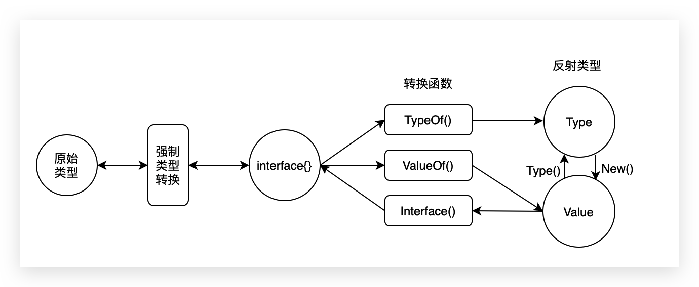

<!--truncate-->


## 1、反射的定义

>It’s a great source of confusion ~ （引用自官方博客）

反射是指在运行时动态的访问和修改任意类型对象的结构和成员，在`go`语言中提供`reflect`包提供反射的功能，每一个变量都有两个属性：类型`Type`和值`Value`

反射能够自描述自控制
例如`python`的反射：根据字符串执行函数，根据字符串导入包

`go`是静态语言，反射就是`go`提供的一种机制，在编译时不知道类型的情况下可以做如下的事情

- 更新变量
- 运行时查看值
- 调用方法
- 对他们的布局进行操作

使用反射的两个经典场景

- 你编写的这个函数，还不知道传给你的类型具体是什么，可能是还没约定好，也可能是传入的类型很多

- 希望通过用户的输入来决定调用哪个函数（根据字符串调用方法），动态执行函数

## 2、反射的基础数据类型



## 3、Type

`reflect.Type`是一个接口类型，用于获取变量类型相关的信息，可通过`reflect.TypeOf`函数获取某个变量的类型信息

源码`go/src/reflect/type.go`

```go
type Type interface {
	Align() int
	FieldAlign() int
	Method(int) Method  // 第 i 个方法
	MethodByName(string) (Method, bool)  // 根据名称获取方法
	NumMethod() int  // 方法的个数
	Name() string  // 获取结构体名称
	PkgPath() string  // 包路径
	Size() uintptr  // 占用内存的大小
	String() string  // 获取字符串表述
	Kind() Kind // 数据类型
	Implements(u Type) bool  // 判断是否实现了某接口
	AssignableTo(u Type) bool  // 能否赋给另外一种类型
	ConvertibleTo(u Type) bool  // 能否转换为另外一种类型
	Comparable() bool
	Bits() int
	ChanDir() ChanDir
	IsVariadic() bool
	Elem() Type  // 解析指针（指针类型转为普通类型）
	Field(i int) StructField  // 第i个成员
	FieldByIndex(index []int) StructField  // 根据index路径获取嵌套成员
	FieldByName(name string) (StructField, bool)  // 根据名称获取成员
	FieldByNameFunc(match func(string) bool) (StructField, bool)
	In(i int) Type
	Key() Type
	Len() int  // 容器的长度
	NumField() int
	NumIn() int  // 输出参数的个数
	NumOut() int  // 返回参数的个数
	Out(i int) Type

	common() *rtype
	uncommon() *uncommonType
}
```

## 4、Value
`reflect.Value`是一个结构体类型，用于获取变量值的信息，可通过`reflect.ValueOf`函数获取修改原始数据类型(某个变量)的值信息

源码`go/src/reflect/value.go`

```go
type Value struct {
   // 代表的数据类型
	typ *rtype
	// 指向原始数据的指针
	ptr unsafe.Pointer
}
```

## 5、反射三大定律

`interface`类型有个`value`，`type`对，而反射就是检查`interface`的这个`value`, `type`对的
具体一点说就是`Go`提供一组方法提取`interface`的`value`，提供另一组方法提取`interface`的`type`

- `reflect.Type`提供一组接口处理`interface`的类型，即`value`, `type`中的`type`
- `reflect.Value`提供一组接口处理`interface`的值,即`value`, `type`中的`value`

### 5.1 反射第一定律

反射第一定律：反射可以将`interface`类型变量转换成反射对象

如何通过反射获取一个变量的值和类型

```go
package main
import (
    "fmt"
    "reflect"
)
func main() {
    var x float64 = 3.4
    t := reflect.TypeOf(x)  //t is reflext.Type
    fmt.Println("type:", t)
    fmt.Println("kind is float64:", v.Kind() == reflect.Float64)
    v := reflect.ValueOf(x) //v is reflext.Value
    fmt.Println("value:", v)
}
```

程序输出
```go
type: float64
kind is float64: true
value: 3.4
```

反射是针对`interface`类型变量的，其中`TypeOf()`和`ValueOf()`接受的参数都是`interface{}`类型的，也即`x`值是被转成了`interface`传入的

### 5.2 反射第二定律

反射第二定律：反射可以将反射对象还原成`interface`对象

之所以叫’反射’，反射对象与`interface`对象是可以互相转化的

```go
package main
import (
    "fmt"
    "reflect"
)
func main() {
    var x float64 = 3.4
    v := reflect.ValueOf(x) //v is reflext.Value
    var y float64 = v.Interface().(float64)
    fmt.Println("value:", y)
}
```

对象`x`转换成反射对象`v`，`v`又通过`Interface()`接口转换成`interface`对象，`interface`对象通过`.(float64)`类型断言获取`float64`类型的值

### 5.3 反射第三定律
反射第三定律：反射对象可修改，`value`值必须是可设置的

通过反射可以将`interface`类型变量转换成反射对象，可以使用该反射对象设置其持有的值

```go
package main
import (
    "reflect"
)
func main() {
    var x float64 = 3.4
    v := reflect.ValueOf(x)
    v.SetFloat(7.1) // Error: will panic.
}
```

通过反射对象v设置新值，会出现`panic`
```
panic: reflect: reflect.Value.SetFloat using unaddressable value
```

错误原因即是`v`是不可修改的。

反射对象是否可修改取决于其所存储的值，回想一下函数传参时是传值还是传址就不难理解上例中为何失败了。

上面例子传入`reflect.ValueOf()`函数的其实是`x`的值，而非`x`本身。即通过`v`修改其值是无法影响`x`的，也即是无效的修改，所以`golang`会报错

想到此处，即可明白，如果构建`v`时使用`x`的地址就可实现修改了，但此时`v`代表的是指针地址，我们要设置的是指针所指向的内容，也即我们想要修改的是`*v`。 通过`v`修改`x`的值?

`reflect.Value`提供了`Elem()`方法，可以获得指针向指向的`value`

```go
package main
import (
"reflect"
    "fmt"
)
func main() {
    var x float64 = 3.4
    v := reflect.ValueOf(&x)
    v.Elem().SetFloat(7.1)
    fmt.Println("x :", v.Elem().Interface())
}
```

输出为：
```
x : 7.1
```

## 6、反射常用的API

### 6.1 获取type类型

```go
typeUser := reflect.TypeOf(&User{}) //通过TypeOf()得到Type类型
fmt.Println(typeUser)                      //*User
fmt.Println(typeUser.Elem())               //User
fmt.Println(typeUser.Name())               //空字符串
fmt.Println(typeUser.Elem().Name())        //User，不带包名的类名称
fmt.Println(typeUser.Kind())               //ptr
fmt.Println(typeUser.Elem().Kind())        //struct
fmt.Println(typeUser.Kind() == reflect.Ptr)
fmt.Println(typeUser.Elem().Kind() == reflect.Struct)
```

### 6.2 获取Field信息

```go
typeUser := reflect.TypeOf(User{}) //需要用struct的Type，不能用指针的Type
fieldNum := typeUser.NumField()           //成员变量的个数
for i := 0; i < fieldNum; i++ {
	field := typeUser.Field(i)
	fmt.Printf("%d %s offset %d anonymous %t type %s exported %t json tag %s\n", i,
		field.Name,            //变量名称
		field.Offset,          //相对于结构体首地址的内存偏移量，string类型会占据16个字节
		field.Anonymous,       //是否为匿名成员
		field.Type,            //数据类型，reflect.Type类型
		field.IsExported(),    //包外是否可见（即是否以大写字母开头）
		field.Tag.Get("json")) //获取成员变量后面``里面定义的tag
//可以通过FieldByName获取Field
if nameField, ok := typeUser.FieldByName("Name"); ok {
	fmt.Printf("Name is exported %t\n", nameField.IsExported())
}
//也可以根据FieldByIndex获取Field
thirdField := typeUser.FieldByIndex([]int{2}) //参数是个slice，因为有struct嵌套的情况
fmt.Printf("third field name %s\n", thirdField.Name)
}
```

### 6.3 获取method信息

```go
typeUser := reflect.TypeOf(common.User{})
methodNum := typeUser.NumMethod() //成员方法的个数。接收者为指针的方法【不】包含在内
for i := 0; i < methodNum; i++ {
	method := typeUser.Method(i)
	fmt.Println(method.Type)  // 会输出函数完整的签名，其中输入参数会将结构体本身也作为输入参数，因此参数个数多一个
	fmt.Printf("method name:%s ,type:%s, exported:%t\n", method.Name, method.Type, method.IsExported())
}
fmt.Println()
if method, ok := typeUser.MethodByName("Examine2"); ok {  // 根据方法名获取
	fmt.Printf("method name:%s ,type:%s, exported:%t\n", method.Name, method.Type, method.IsExported())
}
typeUser2 := reflect.TypeOf(&common.User{})
methodNum = typeUser2.NumMethod() //成员方法的个数。接收者为指针或值的方法都包含在内，也就是说值实现的方法指针也实现了（反之不成立）
for i := 0; i < methodNum; i++ {
	method := typeUser2.Method(i)
	fmt.Printf("method name:%s ,type:%s, exported:%t\n", method.Name, method.Type, method.IsExported())
}
```

### 6.4 获取函数信息

```go
typeFunc := reflect.TypeOf(Add) //获取函数类型
fmt.Printf("is function type %t\n", typeFunc.Kind() == reflect.Func)
argInNum := typeFunc.NumIn()   //输入参数的个数
argOutNum := typeFunc.NumOut() //输出参数的个数
for i := 0; i < argInNum; i++ {
	argTyp := typeFunc.In(i)
	fmt.Printf("第%d个输入参数的类型%s\n", i, argTyp)
}
for i := 0; i < argOutNum; i++ {
	argTyp := typeFunc.Out(i)
	fmt.Printf("第%d个输出参数的类型%s\n", i, argTyp)
}
```

### 6.5 赋值和转换关系

- type1.AssignableTo(type2)  // type1代表的类型是否可以赋值给type2代表的类型
- type1.ConvertibleTo(type2)) // type1代表的类型是否可以转换成type2代表的类型
- java的反射可以获取继承关系，而go语言不支持继承，所以必须是相同的类型才能AssignableTo和ConvertibleTo

示例

```go
u := reflect.TypeOf(User{})
t := reflect.TypeOf(Student{}) //Student内部嵌套了User
u2 := reflect.TypeOf(User{})

//false false
fmt.Println(t.AssignableTo(u))  //t代表的类型是否可以赋值给u代表的类型
fmt.Println(t.ConvertibleTo(u)) //t代表的类型是否可以转换成u代表的类型

//false false
fmt.Println(u.AssignableTo(t))
fmt.Println(u.ConvertibleTo(t))

//true true
fmt.Println(u.AssignableTo(u2))
fmt.Println(u.ConvertibleTo(u2))
```

### 6.6 是否实现接口

```go
//通过reflect.TypeOf((*<interface>)(nil)).Elem()获得接口类型。因为People是个接口不能创建实例，所以把nil强制转为*common.People类型
typeOfPeople := reflect.TypeOf((*common.People)(nil)).Elem()  // 可以将nil理解成People指针的一个实例
fmt.Printf("typeOfPeople kind is interface %t\n", typeOfPeople.Kind() == reflect.Interface)
t1 := reflect.TypeOf(common.User{})
t2 := reflect.TypeOf(&common.User{})
//User的值类型实现了接口，则指针类型也实现了接口；但反过来不行(把Think的接收者改为*User试试)
fmt.Printf("t1 implements People interface %t\n", t1.Implements(typeOfPeople))  // false
fmt.Printf("t2 implements People interface %t\n", t2.Implements(typeOfPeople))  // true
```

### 6.7 value和其他类型的互换

```go
//原始类型转为Value
iValue := reflect.ValueOf(1)
sValue := reflect.ValueOf("hello")
userPtrValue := reflect.ValueOf(&common.User{
	Id:     7,
	Name:   "杰克逊",
	Weight: 65,
	Height: 1.68,
})
fmt.Println(iValue)       //1
fmt.Println(sValue)       //hello
fmt.Println(userPtrValue) //&{7 杰克逊  65 1.68}
//Value转为Type
iType := iValue.Type()
sType := sValue.Type()
userType := userPtrValue.Type()
//在Type和相应Value上调用Kind()结果一样的
fmt.Println(iType.Kind() == reflect.Int, iValue.Kind() == reflect.Int, iType.Kind() == iValue.Kind())                   //true true
fmt.Println(sType.Kind() == reflect.String, sValue.Kind() == reflect.String, sType.Kind() == sValue.Kind())             //true true
fmt.Println(userType.Kind() == reflect.Ptr, userPtrValue.Kind() == reflect.Ptr, userType.Kind() == userPtrValue.Kind()) //true true true

//指针Value和非指针Value互相转换
userValue := userPtrValue.Elem()                    //Elem() 指针Value转为非指针Value
fmt.Println(userValue.Kind(), userPtrValue.Kind())  //struct ptr
userPtrValue3 := userValue.Addr()                   //Addr() 非指针Value转为指针Value
fmt.Println(userValue.Kind(), userPtrValue3.Kind()) //struct ptr

//转为原始类型
//通过Interface()函数把Value转为interface{}，再从interface{}强制类型转换，转为原始数据类型
//或者在Value上直接调用Int()、String()等一步到位
fmt.Printf("origin value iValue is %d %d\n", iValue.Interface().(int), iValue.Int())
fmt.Printf("origin value sValue is %s %s\n", sValue.Interface().(string), sValue.String())
user := userValue.Interface().(common.User)
fmt.Printf("id=%d name=%s weight=%.2f height=%.2f\n", user.Id, user.Name, user.Weight, user.Height)
user2 := userPtrValue.Interface().(*common.User)
fmt.Printf("id=%d name=%s weight=%.2f height=%.2f\n", user2.Id, user2.Name, user2.Weight, user2.Height)
```

### 6.8 value判断空值的三种情况

`pointer`、`channel`、`func`、`interface`、`map`、`slice`的预先声明都是`nil`

```go
var i interface{} //接口没有指向具体的值
v := reflect.ValueOf(i)
fmt.Printf("v持有值 %t, type of v is Invalid %t\n", v.IsValid(), v.Kind() == reflect.Invalid)  // false

var user *common.User = nil
v = reflect.ValueOf(user) //Value指向一个nil
if v.IsValid() {
	fmt.Printf("v持有的值是nil %t\n", v.IsNil()) //调用IsNil()前先确保IsValid()，否则会panic  // true
}

var u common.User //只声明，里面的值都是0值
v = reflect.ValueOf(u)
if v.IsValid() {
	fmt.Printf("v持有的值是对应类型的0值 %t\n", v.IsZero()) //调用IsZero()前先确保IsValid()，否则会panic  // true
}
```

参考
>- https://go.dev/blog/laws-of-reflection

See you ~