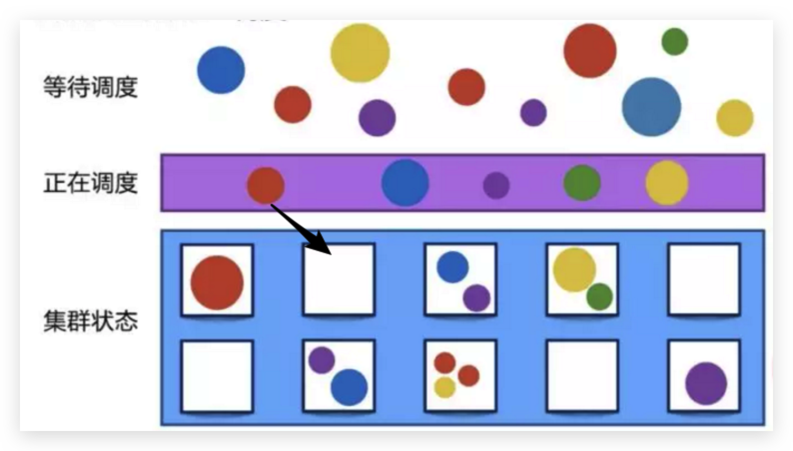
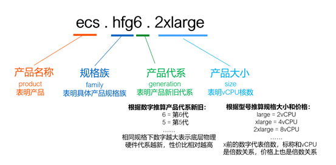
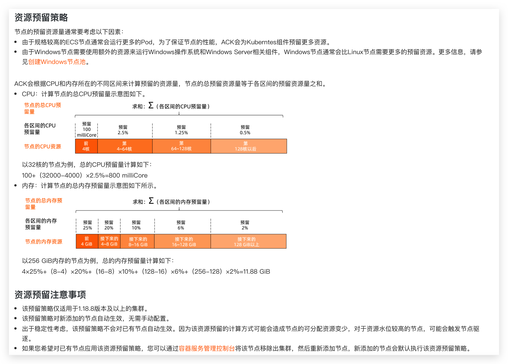
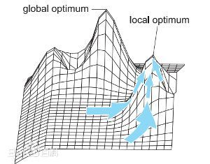

<!--truncate-->


> 名词说明：本文提到的`k8s`集群特指阿里云`ack`（Alibaba Cloud Container Service for Kubernetes）集群

## 1、概述

`Kubernetes`解决了应用的编排、生命周期、自我健康检查和恢复等问题，随着应用容器化（云原生化）的不断完善和落地，方方面面需要考虑的问题也就随之而来

其中应用的调度不乏重要，其关乎着应用的稳定性、资源利用率的完整性与合理性

## 2、原生调度原则

`Kubernetes API Server`接受客户端提交`Pod`对象创建请求后的操作过程中，一个重要的步骤是由调度器程序`kube-scheduler`从当前集群中选择一个可用的最佳节点来接收井运行它，通常是默认的调度器`default-scheduler`负责执行此类任务

```shell
KIND:     Deployment
VERSION:  apps/v1

FIELD:    schedulerName <string>

DESCRIPTION:
     If specified, the pod will be dispatched by specified scheduler. If not
     specified, the pod will be dispatched by default scheduler.
```

设计调度需要考虑的因素：单独和整体的资源请求、硬件/软件/策略限制、亲和以及反亲和要求、数据局域性、负载间的干扰等等

`k8s`调度机制是`k8s`原生提供的一种高效优雅的资源分配机制，它的核心功能是为每个`Pod`找到最适合它的节点，通过合理利用`k8s`原生提供的调度能力，根据业务特性配置合理的调度策略，能有效提高集群中的资源利用率

### 2.1 调度流程

原生的调度流程整体上分为以下三步

- 预选（过滤）——选出可以调度的节点

- 优选（打分）——对选出的节点进行排序

- 选定——按照`pod`优先级选定调度的节点

### 2.2 调度策略

常见的原生调度策略整体上也分为以下几种类型

- Topology——拓扑域调度：例如域（`Region`）、可用区（`Zone`）进行拓扑划分
- nodeName——选定节点调度：直接指定`Node`主机名进行调度（点对点）

- NodeSelector——节点选择器调度：节点标签选择器调度

- NodeAffinity——节点亲和性调度：针对`pod`和`node`之间的调度关系，分为硬亲和和软亲和

- podAffinity——Pod亲和性调度：针对`pod`和`pod`之间的调度关系，也分为硬亲和、软亲和和反亲和

- Priority、QoS——优先和抢占调度：按照[优先级](https://kubernetes.io/zh/docs/concepts/scheduling-eviction/pod-priority-preemption/)（`Priority`）和[服务质量等级](https://kubernetes.io/zh/docs/tasks/configure-pod-container/quality-service-pod/)（`QoS`）两种维度进行调度

- Taint、Toleration——污点和容忍调度：节点拒绝`Pod`调度（污点）和`Pod`能接纳节点污点（容忍）两个维度

## 3、应用和服务概况

应用按照服务用途维度划分主要分为两类：普通`service`类型和`worker`类型，其中分别包含

普通`service`类型

- 有状态服务：少数服务，如`mysql`、`redis`
- 无状态服务：多数服务

`worker`类型

- 普通`worker`服务
- `gpu`型`worker`服务

按照应用使用的资源类别划分，可对应用大致分为以下几类

- 通用计算
  - `CPU`计算密集型：大量计算，消耗`CPU`资源
  - `IO`密集型：网络、磁盘`IO`要求高
  - 通用型：对`CPU`和`IO`要求相对适中
- 异构计算
  - `GPU`计算型：深度学习训练
  - `GPU`虚拟化型：图形和图像处理
- 某些特殊领域和用途的服务：例如高主频、高内存等等

## 4、阿里云集群概况

### 4.1 集群概况

本文的`kubernetes`集群都是由阿里云`ack`托管的，其中包含了`ACK Pro`版和边缘 `Pro` 版两种类型的集群

边缘 `Pro` 版主要是涉及云上云下的`GPU`节点混合部署的集群

本文仅讨论`ACK Pro`集群（其中`Master`节点由阿里云容器服务创建并托管）

### 4.1 node节点的规划

#### 4.1.1 阿里云ecs介绍

选择服务器的硬件资源配置就和我们购买办公或个人`PC`、笔记本一样，主要需要考虑主板、`CPU`、内存、硬盘等硬件配置

`CPU`与内存通信，主要通过地址、数据、控制三大总线

先简单了解一下`CPU`核数与内存的配比主要要遵守的基本原则

- 频率要同步：内存的核心频率要等于或稍大于`CPU`的外频
- 带宽要匹配：内存的数据带宽跟`CPU`前端总线的带宽尽量相等
- 主板要调控：当以上两个条件有时是不可能同时能满足时就要靠主板通过异步设置来调控

通常`CPU`和内存的配比是`1:2`、`1:4`、`1:8`，至于为什么，这也是一个值得讨论的话题

阿里云`ack`将集群的`master`节点托管了，因此只需要考虑如何规划`node`节点。由于是“花钱”买服务，当然要本着较高“性价比”的原则去合理搭配`node`节点的选型和配比

节点即虚拟机，在阿里云也叫做`ECS`，先来看下目前阿里云通用的`x86`节点有哪些种类，在阿里云官网将`ECS`实例分为很多种：通用型、计算型、内存型、大数据型、本地`SSD`型、高主频型、安全增强型、`GPU`型、异构服务型、突发型、共享型等等（简直太多了）

为了合理选型，一个重要的途径是理解`ECS`的实例规格族的命名方式和其信息布局，常见的如下

- 通用型，适用于大多数场景，代称是`g`系列，其`vCPU`和内存的配比是`1:4`

- 计算型，某些场景下对`CPU`算力要求会更高一点，代称是`c`系列，其`vCPU`和内存的配比是`1:2`

- 内存型，提供更多的内存能力，代称是`r`系列，其`vCPU`和内存的配比是`1:8`

- 大数据型和本地`SSD`型，这两种的CPU和内存的配比都是`1:4`，区别在于本地盘的类型不一样，导致适合的场景也是不一样的，大数据型的简称是`d`，本地`SSD`型简称是`i`
- 高主频型，通常的`CPU`的主频应该是`2.5G`赫兹，有一些可以是达到`3.2G`赫兹甚至更高，这种就是高主频型，代号会在前面加上`hf`标识

阿里云实例规格的命名方式和规律如下



实例选型原则通常遵循下面三点

- 相同大小的企业级实例比入门级实例性能更稳定，但入门级实例性价比更高，因为企业级实例独占`vCPU`，不存在资源争抢
- 相同实例规格，新一代比老一代性价比更高，新一代实例规格释放更多技术红利
- 合适的实例规格搭配合适的块存储类型才能达到预期性能（高效云盘/`SSD`/`ESSD`/本地盘）

#### 4.1.2 k8s集群节点选型原则

`k8s`集群节点如何选型？

从`CPU`为出发点，`CPU`选定的同时，按照一定配比的内存大小也相应确定

节点区分标准线的划定。`vCPU`的个数是决定实例价格的关键，`vCPU`个数实例的一个`xlarge`单位代表`4`个`vCPU`，以`8xlarge`即`32`个`vCPU`为分界线，小于`32`个`vCPU`的实例划分为较小`CPU`核数即`small`节点，把大于或等于`32`个`vCPU`的实例划分为较大`CPU`核数即`large`节点

但是，需要购买分别高、低至多少个`vCPU`的节点作为`k8s`集群的`node`呢？换句话说，是使用更少的大节点还是使用更多的小节点来组建`k8s`集群呢？

可以把整个`k8s`集群中所有`node`组成的节点理解成为一个大型的单个节点，换句话说，这就和一台价格昂贵全部满配的物理机一样，其`node`节点就是这台物理机虚拟出来的`VM`

举个栗子，需要一个节点池总量为`64C/256GB`的集群，考虑`k8s`需要多节点，因此两个比较极端的配比是`2`台`32C/128GB`的较大节点和`8`台`8C/32GB`的较小节点

这里对大节点和小节点的优缺点分析和列举了以下几点

- 大节点个数总量较少，带来的管理成本会更少
- 大节点支持资源使用较高的“饥饿”型应用，即资源消耗较高的应用
- 发生`node`节点级别的扩缩容时，大节点成本更高，因为一次就需要扩容配置较高的节点
- 大节点每个节点运行的`pod`数较多，相应的`k8s`组件压力更大，当出现大批量`pod`频繁创建销毁时，组件性能、时效性和可靠性都会下降，因此`k8s`官方推荐的节点`pod`最大数默认为`110`
- 大节点`pod`副本分布更集中，由于节点数量减少，在同一个节点出现相关`pod`副本的可能性增大，当出现故障时，对`pod`影响较大。如果`pod`副本数更少，那么对整个应用来说，故障率和中断率也更高
- 按照阿里云[资源预留公式](https://help.aliyun.com/document_detail/330995.html)推算的预留资源更多，大节点相对可分配给`pod`的资源总量就会变少



说到这里，到底是该使用少量大节点还是大量小节点呢？按照上面的分析，各有利弊，因此并没有一定之规

退而求其次，可以均衡搭配，使用不同大小的节点来混合构建集群，对于某些特殊的服务，还可以单独做节点池

另外，对于`worker`任务型服务，充分利用云平台弹性伸缩能力，选用抢占式实例，更节省成本

`k8s`集群初始化创建时，会创建一个默认的节点池`default-nodepool`，一般会选择`3`台中等配置的`ECS`实例

往往为了应用在不同环境的隔离，在资源足够的情况下，会将`dev`、`staging`、`prod`等不同环境放在各自不同的集群中，当然也可以将`prod`生产环境单独做集群，`dev`和`staging`环境放在一套集群，这样成本更低

剩下就是根据应用的特点、成本设计与规划节点池

#### 4.1.3 k8s集群节点池设计

根据服务特性规划出不同的节点池，混合组建成集群，有助于集群资源利用率的提高

使用抢占式策略，并结合利用了公有云的弹性伸缩能力，用于自动扩缩集群节点数量，以真正实现资源利用率的提升，可以在较大程度上优化用户账单

根据业务现有相关服务的类型特点，加上合理考虑成本与收费类型的前提，加上默认的节点池，将节点池分为以下几类

| 节点池类型         | 适用环境 | 付费策略 | 节点池/节点命名    | 资源配额                            | 服务特点                                                     |
| ------------------ | -------- | -------- | ------------------ | ----------------------------------- | ------------------------------------------------------------ |
| 系统节点池           | prod nonprod | 包年包月 | `default-nodepool` |                                     | 适用于部署`k8s`集群系统组件                                  |
| 稳定型节点池       | prod nonprod | 包年包月 | `${env}-packets` | `32C/128GB/500GB`                   | 适用于副本数相对稳定，资源要求相对适中，稳定性要求相对较高，版本迭代速率相对较小的核心服务 |
| 大磁盘型节点       | prod     | 包年包月 | `${env}-disk-large` | `32C/256GB/5TB`                     | 适用于对磁盘读写空间较大的服务                               |
|                    | nonprod | 包年包月 | `${env}-disk-large` | `16C/128GB/2TB`                     | 适用于对磁盘读写空间较大的服务                               |
| 大配置节点         | prod nonprod | 抢占式   | `${env}-large`  | `32C/128GB/500GB` `32C/256GB/500GB` | 适用于`CPU/Mem`资源要求较大的`worker`类型服务                |
| 小配置节点         | prod nonprod | 抢占式   | `${env}-small`  | `16C/64GB/300GB`                    | 适用于`CPU/Mem`资源要求较小的`worker`类型服务                  |
| 大配置较大磁盘节点 | prod     | 抢占式   | `${env}-medium-disk-large` | `32C/256GB/1TB`                     | 适用于`CPU/Mem/Disk`资源要求较大的`worker`类型服务           |
|                    | nonprod | 抢占式   | `${env}-medium-disk-large` | `32C/128GB/500GB`                   | 适用于`CPU/Mem/Disk`资源要求较大的`worker`类型服务           |

## 5、调度策略的设计

### 5.1 原生调度类型的取舍

有了规划出的不同节点池，就需要根据每个应用的特性，基于原生的调度原则进行调度，但是原生的调度也相对多样，如何取舍，还是都用？（不是小孩子，当然不能全都要）

例如应用的`pod`之间还没有很明显的亲和性及反亲和性需求，也还没有严格的网络入站出站限制的需求，不同节点也都处于云网络的各个交换机组成的大型子网内

因此，不采用拓扑域、`Pod`亲和性调度这两种调度方式

对于`nodeName`调度，比较单一，也不采用

对于优先和抢占调度，目前也还没有严格意义上区分服务的优先等级，因为可以认为每个服务都是整个业务不可缺少的一环。换句话说，目前对于服务的优先级还没有明确的评判标准。因此服务质量`QoS`采用最高的优先级即`Guaranteed`，其要求`Pod`里的每个容器都必须有`CPU `和内存的`request`和`limit`，而且值必须相等

对于`NodeSelector`和`NodeAffinity`，后者更为灵活，具有优先调度的功能，其组合方式有两种，硬亲和和软亲和，其判断亲和性的计算方法也多样，不仅是等值匹配，相当于升级版本的`NodeSelector`。`NodeAffinity`适用于让`Pod`调度到某些节点上，以及不想让`pod`调度到某些节点上，而且如果节点设置了`Label`，但是`Pod`没有任何的`NodeAffinity`设置，那么`Pod`还是可以调度到这些节点上的

另外一方面，如果集群中的节点有多种类别，使用`NodeAffinity`对某一类节点做`label`，目的是想让某些`pod`调度到这些节点。而如果`pod`没有标识亲和性调度，那么`pod`有可能调度到集群中其他的节点，这种情况下结果是不可控的，因为总不可能所有节点都标识同样的亲和性

`NodeAffinity`亲和性的设计本身就是为了拉近在调度时`pod`和`node`之间的距离，但又没有办法避免上面的问题，于是就有了污点和容忍

污点的特点是，常用在某个或某些`Node`不让大多数`Pod`调度而只让少部分`Pod`调度

对于`Taint`和`Toleration`，出发点一个在于`Node`，一个在于`Pod`，其组合方式有以下几种

| Node污点           | Pod容忍            | 是否调度成功 | 原因                            |
| ------------------ | ------------------ | ------------ | ------------------------------- |
| `PreferNoSchedule` | `PreferNoSchedule` | 是           | `node`的污点与`pod`的容忍相匹配 |
| `PreferNoSchedule` | `NoSchedule`       | 是           | `node`的污点低于`pod`的容忍     |
| `PreferNoSchedule` | `NoExecute`        | 是           | `node`的污点低于`pod`的容忍     |
| `NoSchedule`       | `PreferNoSchedule` | 否           | `node`的污点高于`pod`的容忍     |
| `NoSchedule`       | `NoSchedule`       | 是           | `node`的污点与`pod`的容忍相匹配 |
| `NoSchedule`       | `NoExecute`        | 否           | `node`的污点与`pod`的容忍互逆   |
| `NoExecute`        | `PreferNoSchedule` | 否           | `node`的污点高于`pod`的容忍     |
| `NoExecute`        | `NoSchedule`       | 否           | `node`的污点高于`pod`的容忍     |
| `NoExecute`        | `NoExecute`        | 否           | `pod`会不断重建和杀掉           |

由上述分析可得

`Node`如果打上`PreferNoSchedule`的污点，那么`Pod`只要配置了容忍都会被调度上，甚至于没有设置任何污点容忍的`Pod`也能调度到此节点上。原因在于`PreferNoSchedule`的意思是优先不调度，但是当没有节点可用时`Pod`仍然能调度到此节点

`Node`如果打上`NoExecute`的污点，那么`Pod`只要配置了容忍都会被调度上

因此`Node`的污点类型为`NoSchedule`，对于不同的节点池，打上不同的污点，例如`large:true :NoSchedule`

为了规范，对于`pod`来说，容忍度的操作符统一使用`Equal`属性。然后根据不同节点池的污点设置对应的容忍，例如

```yaml
tolerations:
- effect: NoSchedule
  key: large
  operator: Equal
  value: 'true'
```

### 5.2 局部最优解理论

局部最优，是在工程设计中经常采用的理论，指对于一个问题的解在一定范围或区域内最优，或者说解决问题或达成目标的手段在一定范围或限制内最优

例如往往对于应用的优化是没有天花板的，拿到调度方案的设计来说也是一样，因为多种方案最终还是要为业务服务，随着业务的复杂性、变化性会不断变化，这种情况下会更容易实现和接收在某些局部条件下最优（更优）的方案

局部最优解的质量不一定都是差的。尤其是当有了确定的评判标准标明得出的解是可以接受的话，通常会接收局部最优的结果。这样，从成本、效率等多方面考虑，才是实际工程中会采取的策略



### 5.3 结合服务特性的调度原则

基于对上面原生调度类型的分析及取舍，可以认为每个不同节点池即每一类节点都算作稀缺资源，通常应该不允许或者不建议对不符合的服务进行调度，也就是每一类节点都应该是被特定调度的。因为有了对应的服务我们才去合理取材，选择对应特性的节点，这也直接和用户的账单挂钩并且占比非常大

另外一方面，集群没有多租户，没有严格的应用隔离性要求

结合应用特性，目前采用的调度主要结合`nodeSelector`、`Taint`及`Toleration`，规范如下

按照节点池的分类，分别给`node`打上了以下污点

| 节点池                     | 标签（label）                                             | 污点（Taints）                                               |
| -------------------------- | --------------------------------------------------------- | ------------------------------------------------------------ |
| `${env}-packets`           | `packets:true`                                            | `packets:true :NoSchedule`                                   |
| `${env}-disk-large`        | `disk-large:true `                                        | `disk-large:true :NoSchedule`                                |
| `${env}-large`             | `workload_type:spot ` `prod:true `                        | `prod:true :NoSchedule`                                          `large:true :NoSchedule` |
| `${env}-small`             | `workload_type:spot ` `prod:true `                        | `prod:true :NoSchedule`                                          `small:true :NoSchedule` |
| `${env}-medium-disk-large` | `workload_type:spot`            `medium-disk-large:true ` | `medium-disk-large:true :NoSchedule`                         |

服务调度规范，根据上述`node`标签和污点，在对应服务的`pod`中分别对应需要如下的`nodeSelector`和`tolerations`

```yaml
# 调度到packets节点池的节点
nodeSelector:
  packets: 'true'
tolerations:
- effect: NoSchedule
  key: packets
  operator: Equal
  value: 'true'

---
# 调度到disk-large节点池的节点
nodeSelector:
  disk-large: 'true'
tolerations:
- effect: NoSchedule 
  key: disk-large 
  operator: Equal 
  value: 'true'

---
# 调度到large节点池的节点
nodeSelector:
  prod: 'true'
tolerations:
- effect: NoSchedule 
  key: prod
  operator: Equal 
  value: 'true'
- effect: NoSchedule
  key: large
  operator: Equal
  value: 'true'

---
# 调度到small节点池的节点
nodeSelector:
  prod: 'true'
tolerations:
- effect: NoSchedule 
  key: prod
  operator: Equal 
  value: 'true'
- effect: NoSchedule
  key: small
  operator: Equal
  value: 'true'

---
# 调度到medium-disk-large节点池的节点
nodeSelector:
  medium-disk-large: 'true'
tolerations:
- effect: NoSchedule 
  key: medium-disk-large
  operator: Equal 
  value: 'true'
```

### 5.4 应用分类标准

有了对节点的分类规范及节点的调度方法使用规范，不同的应用服务应该以什么标准来区分它应该调度到哪一类节点呢，主要参考以下标准

- 对于新接入的应用服务，在优化`code`的前提下，接入前做好应用占用稳定时资源测试、性能时资源测试以及持续观测，例如借助于监控、`netdata`等工具，对应用的资源限制给定一个较为合理的阈值

- 对于普适性应用，没有一个严格的标准来区分是应该调度到大节点还是小节点。因此和大节点和小节点区分标准一样，加上考虑到节点的资源预留情况，约定以`5C/5G`为判定应用资源大小的分界线，小于`5`个`vCPU`的应用划分为调度到较小`CPU`核数即`small`节点，把大于或等于`5`个`vCPU`的实例划分为较大`CPU`核数即`large`节点
- 对于占用`CPU`较低、但内存等`IO`要求较高的应用，这类也是应用最为普遍的类型，即`IO密集型`，应用在运行期间，`99%`的时间都花在`IO`上，花在`CPU`上的时间很少，为了不浪费`CPU`资源以及碎片化资源的集中管理，尽量保障节点`pod`数量的均衡，约定将这类应用调度到较大`CPU`核数即`large`节点

- 对于特殊应用，例如稳定且核心的、大磁盘的、大内存的、计算密集型的这类应用很好区分，对应节点池调度即可

## 6、展望

本文分析介绍基于`ack`，结合`k8s`原生调度方式，综合考虑现有应用自身特性、节点池资源特性、成本、效率等方向而设计的调度规范参考

后续随着业务的复杂性增强，会将更多的调度设计原理与业务相结合，充分利用公有云及`k8s`的新生特性，例如在离线业务混合部署、拓扑感知调度、二次调度、弹性容器实例`ECI`、`Serveless`函数计算等，甚至于出现可用的调度方式都不满足的调度需求，实现自定义调度，进而实现更多更好更强贴近业务、使用效率提升的服务调度方式，根据更多的数据指标和服务中链路的追踪来进一步优化业务，最终实现业务的快速迭代、自动部署、独立高效