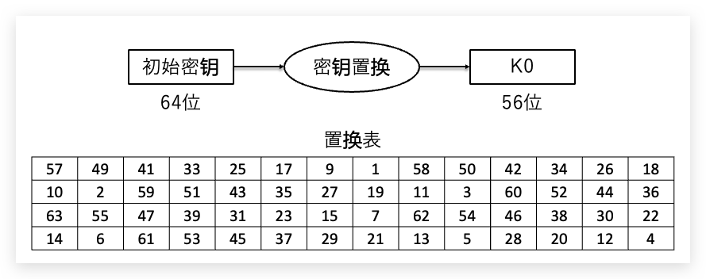
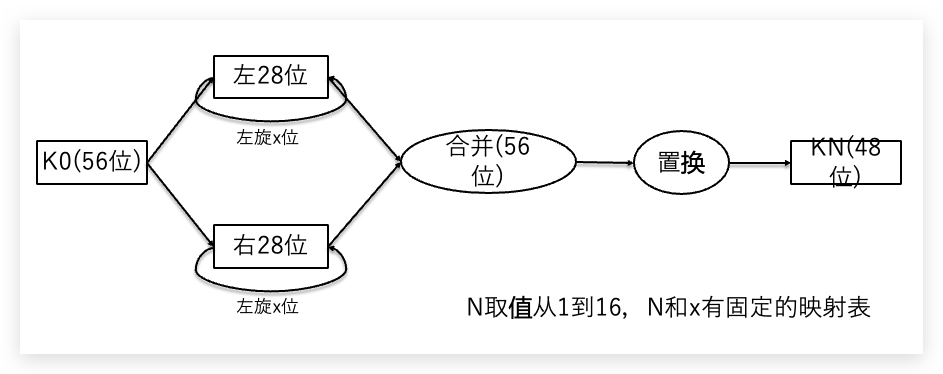
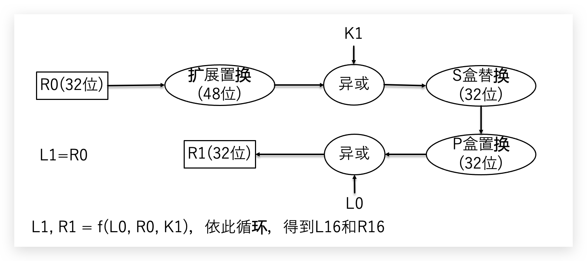
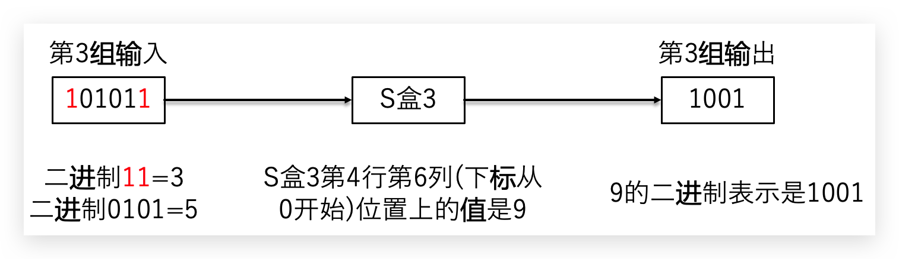

<!--truncate-->


## 1、对称加密介绍

对称加密算法用来对敏感数据等信息进行加密，常用的算法包括：

- DES(Data Encryption Standard)：数据加密标准，速度较快，适用于加密大量数据的场合
- 3DES(Triple DES)：是基于`DES`，对一块数据用三个不同的密钥进行三次加密，强度更高
- AES(Advanced Encryption Standard)：高级加密标准，是下一代的加密算法标准，速度快，安全级别高
- CBC 分组加密的四种模式之一`ECB`、`CBC`、`CFB`、`OFB`

对称加密又分为分组加密和序列密码
- 分组密码，也叫块加密`block cyphers`，一次加密明文中的一个块。是将明文按一定的位长分组，明文组经过加密运算得到密文组，密文组经过解密运算（加密运算的逆运算），还原成明文组

- 序列密码，也叫流加密`stream cyphers`，一次加密明文中的一个位。是指利用少量的密钥（制乱元素）通过某种复杂的运算（密码算法）产生大量的伪随机位流，用于对明文位流的加密

对称加密的特点

- 加密过程每一步都是可逆的

- 加密和解密用的是同一组密钥


## 2、DES

### 2.1 概述

DES（`Data Encryption Standard`）数据加密标准，是目前最为流行的加密算法之一
DES是一种使用密钥加密的块算法，`1977`年被美国联邦政府的国家标准局确定为联邦资料处理标准`FIPS`，并授权在非密级政府通信中使用，随后该算法在国际上广泛流传开来

AES与3DES的比较


| 算法名称 | 算法类型 | 密钥长度 | 速度 | 解密时间（建设机器每秒尝试255个密钥）| 资源消耗 |
|  ----  | ----  | --- | --- | --- | --- |
| AES | 对称block密码 | 128、192、256位 | 高 | 1490000亿年 |低 |
| 3DES | 对称feistel密码 | 112位或168位 | 低 | 46亿年 | 中 |

破解历史

历史上有三次对`DES`有影响的攻击实验。`1997`年，利用当时各国 `7`万台计算机，历时`96`天破解了`DES`的密钥。`1998`年，电子边境基金会（EFF）用`25`万美元制造的专用计算机，用`56`小时破解了`DES`的密钥。1999年，`EFF`用`22`小时`15`分完成了破解工作

### 2.2 主要思路

对原始数据（明文）进行分组，每组`64`位`bit`，最后一组不足`64`位时按一定规则填充，每一组上单独施加`DES`算法

### 2.3 DES子密钥生成

- 第一步

初始密钥`64`位，实际有效位`56`位，每隔`7`位有一个校验位
根据初始密钥生成`16`个`48`位的字密钥

密钥置换（打散），64——>56


例如，第`57`位放在第`1`个位置，第`49`位放在第`2`个位置，将顺序打乱并去除了校验位

- 第二步

左旋右旋，再次置换56——>48


### 2.4 DES加密过程

明文——>初始置换——>L0(`32`位)、R0(`32`位)


`S`盒替换的逻辑
输入`48`位，输出`32`位，各分为`8`组，输入每组`6`位，输出每组`4`位
分别在每组上施加`S`盒替换，一共`8`个`S`盒



合并
L16(`32`位)、R16(`32`位)——>合并——>最终置换——>密文（`64`位）

### 2.5 使用示例

```go
/DesEncrypt DES加密
//密钥必须是64位，所以key必须是长度为8的byte数组
func DesEncrypt(text string, key []byte) (string, error) {
	if len(key) != 8 {
		return "", fmt.Errorf("DES加密算法要求key必须是64位bit")
	}
	block, err := des.NewCipher(key) //用des创建一个加密器cipher
	if err != nil {
		return "", err
	}
	src := []byte(text)
	blockSize := block.BlockSize()           //分组的大小，blockSize=8
	src = common.ZeroPadding(src, blockSize) //填充成64位整倍数

	out := make([]byte, len(src)) //密文和明文的长度一致
	dst := out
	for len(src) > 0 {
		//分组加密
		block.Encrypt(dst, src[:blockSize]) //对src进行加密，加密结果放到dst里
		//移到下一组
		src = src[blockSize:]
		dst = dst[blockSize:]
	}
	return hex.EncodeToString(out), nil
}

//DesDecrypt DES解密
//密钥必须是64位，所以key必须是长度为8的byte数组
func DesDecrypt(text string, key []byte) (string, error) {
	src, err := hex.DecodeString(text) //转成[]byte
	if err != nil {
		return "", err
	}
	block, err := des.NewCipher(key)
	if err != nil {
		return "", err
	}

	blockSize := block.BlockSize()
	out := make([]byte, len(src))
	dst := out
	for len(src) > 0 {
		//分组解密
		block.Decrypt(dst, src[:blockSize])
		src = src[blockSize:]
		dst = dst[blockSize:]
	}
	out = common.ZeroUnPadding(out) //反填充
	return string(out), nil
}
```

### 2.6 分组模式

- CBC（Cipher Block Chaining）密文分组链接模式，将当前明文分组与前一个密文分组进行异或运算，然后再进行加密
- 其他分组模式还有ECB、CTR、CFR、OFB

分组模式使用示例

```go
func DesEncryptCBC(text string, key []byte) (string, error) {
	src := []byte(text)
	block, err := des.NewCipher(key) //用des创建一个加密器cipher
	if err != nil {
		return "", err
	}
	blockSize := block.BlockSize()           //分组的大小，blockSize=8
	src = common.ZeroPadding(src, blockSize) //填充

	out := make([]byte, len(src))                   //密文和明文的长度一致
	encrypter := cipher.NewCBCEncrypter(block, key) //CBC分组模式加密
	encrypter.CryptBlocks(out, src)
	return hex.EncodeToString(out), nil
}

func DesDecryptCBC(text string, key []byte) (string, error) {
	src, err := hex.DecodeString(text) //转成[]byte
	if err != nil {
		return "", err
	}
	block, err := des.NewCipher(key)
	if err != nil {
		return "", err
	}

	out := make([]byte, len(src))                   //密文和明文的长度一致
	encrypter := cipher.NewCBCDecrypter(block, key) //CBC分组模式解密
	encrypter.CryptBlocks(out, src)
	out = common.ZeroUnPadding(out) //反填充
	return string(out), nil
}
```

## 3、AES

AES（`Advanced Encryption Standard`）高级加密标准，旨在取代`DES`

`2000`年`10`月，`NIST`(美国国家标准和技术协会)宣布通过从`15`种侯选算法中选出的一项新的密匙加密标准。`Rijndael`被选中成为将来的`AES`。 `Rijndael`是在`1999`年下半年，由研究员`Joan Daemen`和`Vincent Rijmen`创建的。`AES`正日益成为加密各种形式的电子数据的实际标准
并于`2002`年`5`月`26`日制定了新的高级加密标准`AES`规范

算法原理

`AES`算法基于排列和置换运算。排列是对数据重新进行安排，置换是将一个数据单元替换为另一个。`AES`使用几种不同的方法来执行排列和置换运算。
`AES`是一个迭代的、对称密钥分组的密码，它可以使用`128`、`192`和`256`位密钥，并且用`128`位（`16`字节）分组加密和解密数据。与公共密钥密码使用密钥对不同，对称密钥密码使用相同的密钥加密和解密数据。通过分组密码返回的加密数据的位数与输入数据相同。迭代加密使用一个循环结构，在该循环中重复置换和替换输入数据

综上看来`AES`安全度最高, 基本现状就是`AES`已经替代`DES`成为新一代对称加密的标准

`AES`使用示例

```go
package main
import (
	"crypto/aes"
	"crypto/cipher"
	"fmt"
)
var commonIV = []byte{0x00, 0x01, 0x02, 0x03, 0x04, 0x05, 0x06, 0x07, 0x08, 0x09, 0x0a, 0x0b, 0x0c, 0x0d, 0x0e, 0x0f}
func encrypt(plainText string, keyText string) (cipherByte []byte, err error) {
	// 转换成字节数据, 方便加密
	plainByte := []byte(plainText)
	keyByte := []byte(keyText)
	// 创建加密算法aes
	c, err := aes.NewCipher(keyByte)
	if err != nil {
		return nil, err
	}
	//加密字符串
	cfb := cipher.NewCFBEncrypter(c, commonIV)
	cipherByte = make([]byte, len(plainByte))
	cfb.XORKeyStream(cipherByte, plainByte)
	return
}
func decrypt(cipherByte []byte, keyText string) (plainText string, err error) {
	// 转换成字节数据, 方便加密
	keyByte := []byte(keyText)
	// 创建加密算法aes
	c, err := aes.NewCipher(keyByte)
	if err != nil {
		return "", err
	}
	// 解密字符串
	cfbdec := cipher.NewCFBDecrypter(c, commonIV)
	plainByte := make([]byte, len(cipherByte))
	cfbdec.XORKeyStream(plainByte, cipherByte)
	plainText = string(plainByte)
	return
}
func main() {
	plain := "The text need to be encrypt."
	// AES 规定有3种长度的key: 16, 24, 32分别对应AES-128, AES-192, or AES-256
	key := "abcdefgehjhijkmlkjjwwoew"
	// 加密
	cipherByte, err := encrypt(plain, key)
	if err != nil {
		fmt.Println(err)
	}
	fmt.Printf("%s ==> %x\n", plain, cipherByte)
	// 解密
	plainText, err := decrypt(cipherByte, key)
	if err != nil {
		fmt.Println(err)
	}
	fmt.Printf("%x ==> %s\n", cipherByte, plainText)
}
```

## 4、CBC

分组密码，也叫块加密`block cyphers`，一次加密明文中的一个块。是将明文按一定的位长分组，明文组经过加密运算得到密文组，密文组经过解密运算（加密运算的逆运算），还原成明文组。
序列密码，也叫流加密`stream cyphers`，一次加密明文中的一个位。是指利用少量的密钥（制乱元素）通过某种复杂的运算（密码算法）产生大量的伪随机位流，用于对明文位流的加密。
解密是指用同样的密钥和密码算法及与加密相同的伪随机位流，用以还原明文位流

分组加密算法中，有`ECB`,`CBC`,`CFB`,`OFB`这几种算法模式, 我们介绍其中常用的一种`CBC`

`CBC`(`Cipher Block Chaining`)密文分组链接方式

加密步骤如下：
- 首先将数据按照8个字节一组进行分组得到`D1D2......Dn`（若数据不是8的整数倍，用指定的`PADDING`数据补位）
- 第一组数据`D1`与初始化向量I异或后的结果进行`DES`加密得到第一组密文`C1`（初始化向量I为全零）
- 第二组数据`D2`与第一组的加密结果`C1`异或以后的结果进行`DES`加密，得到第二组密文`C2`
- 之后的数据以此类推，得到`Cn`
- 按顺序连为`C1C2C3......Cn`即为加密结果

```go
// aesCBCEncrypt aes加密，填充秘钥key的16位，24,32分别对应AES-128, AES-192, or AES-256.
func aesCBCEncrypt(rawData, key []byte) ([]byte, error) {
	block, err := aes.NewCipher(key)
	if err != nil {
		return nil, err
	}

	//填充原文
	blockSize := block.BlockSize()
	rawData = pkcs7Padding(rawData, blockSize)
	//初始向量IV必须是唯一，但不需要保密
	cipherText := make([]byte, blockSize+len(rawData))
	//block大小 16
	iv := cipherText[:blockSize]
	if _, err := io.ReadFull(rand.Reader, iv); err != nil {
		return nil, err
	}

	//block大小和初始向量大小一定要一致
	mode := cipher.NewCBCEncrypter(block, iv)
	mode.CryptBlocks(cipherText[blockSize:], rawData)

	return cipherText, nil
}
```

解密是加密的逆过程，步骤如下：
+ 首先将数据按照`8`个字节一组进行分组得到`C1C2C3......Cn`
+ 将第一组数据进行解密后与初始化向量`I`进行异或得到第一组明文`D1`（注意：一定是先解密再异或）
+ 将第二组数据`C2`进行解密后与第一组密文数据进行异或得到第二组数据`D2`
+ 之后依此类推，得到`Dn`
+ 按顺序连为`D1D2D3......Dn`即为解密结果

```go
func aesCBCDecrypt(encryptData, key []byte) ([]byte, error) {
	block, err := aes.NewCipher(key)
	if err != nil {
		return nil, err
	}

	blockSize := block.BlockSize()

	if len(encryptData) < blockSize {
		return nil, errors.New("ciphertext too short")
	}
	iv := encryptData[:blockSize]
	encryptData = encryptData[blockSize:]

	// CBC mode always works in whole blocks.
	if len(encryptData)%blockSize != 0 {
		return nil, errors.New("ciphertext is not a multiple of the block size")
	}

	mode := cipher.NewCBCDecrypter(block, iv)

	// CryptBlocks can work in-place if the two arguments are the same.
	mode.CryptBlocks(encryptData, encryptData)
	//解填充
	encryptData = pkcs7UnPadding(encryptData)
	return encryptData, nil
}
```

这里要注意的是，解密的结果并不一定是我们原来的加密数据，可能还含有补位，一定要把补位去掉才是原来的数据

特点：
- 不容易主动攻击,安全性好于`ECB`,适合传输长度长的报文,是`SSL`、`IPSec`的标准。每个密文块依赖于所有的信息块, 明文消息中一个改变会影响所有密文块
- 发送方和接收方都需要知道初始化向量
- 加密过程是串行的，无法被并行化（在解密时，从两个邻接的密文块中即可得到一个平文块。因此，解密过程可以被并行化）


See you ~
