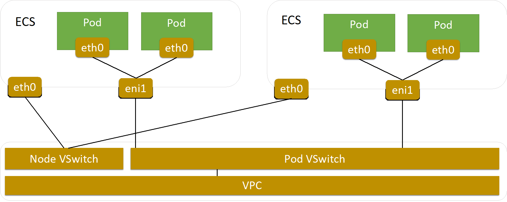
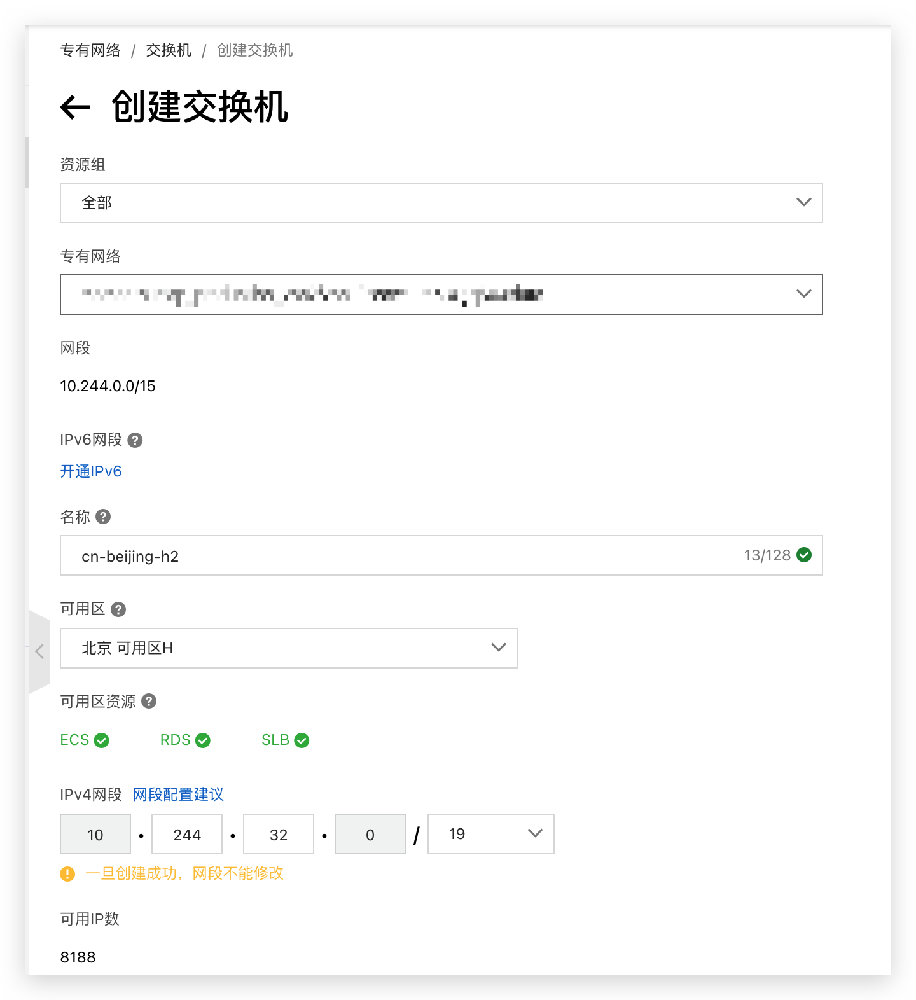
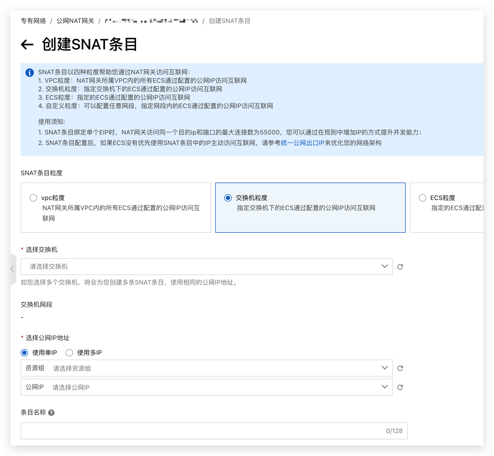

<!--truncate-->



## 1、Terway网络介绍

`Terway`是阿里云开源的基于专有网络VPC的容器网络接口`CNI`（Container Network Interface）插件，支持基于`Kubernetes`标准的网络策略来定义容器间的访问策略。可以通过使用`Terway`网络插件实现`Kubernetes`集群内部的网络互通

`Terway`网络插件将原生的弹性网卡分配给`Pod`实现`Pod`网络，支持基于`Kubernetes`标准的网络策略（Network Policy）来定义容器间的访问策略，并兼容`Calico`的网络策略

在`Terway`网络插件中，每个`Pod`都拥有自己网络栈和`IP`地址。同一台`ECS`内的`Pod`之间通信，直接通过机器内部的转发，跨`ECS`的`Pod`通信，报文通过`VPC`的弹性网卡直接转发。由于不需要使用`VxLAN`等的隧道技术封装报文，因此`Terway`模式网络具有较高的通信性能

一句话总结，`Terway`最大的特点就是借助于云上`ECS`服务器的特性，将`pod`与`node`的网络进行了拉平，同时使用`VPC`下`vSwitch`中的`ip`

## 2、问题现象

由于使用了`Terway`网络模式，随着`node`机器和`pod`数量的增多，每分配一个`ip`出去都需要消耗掉`vpc`下`vsw`的可用`ip`。如果某短时间业务快速增长，导致`pod`大量消耗可用`ip`，这个时候就有可能因前期规划不充足导致`vSwitch`的可用`ip`不足

这个时候新创建的`pod`状态为`ContainerCreating`，`describe`查看`pod`提示`error allocate ip...`，这个时候查看`Pod`所在节点的`Terway`的日志，会有下面内容

```shell
Message: The specified VSwitch "vsw-xxxxx" has not enough IpAddress.
```

提示没有足够的`ip`，这个时候基本都是由于交换机的`ip`不够用，登录到交换机的控制台可以查看到这个节点所在的交换机的可用`ip`数，如果很少甚至为`0`，就表示需要扩容了

## 3、扩容操作

### 3.1 新增交换机并配置NAT

在专有网络管理控制台对应的`VPC`创建新的`vSwitch`，该`vSwitch`必须与`IP`资源不足的`vSwitch`在同一个区域。这是因为`Terway`分配给`pod ip`时的策略是，分配`node`所在可用区中的`vSwitch`对应的`ip`，因此，扩容就需要扩容同一可用区的交换机

在初始化集群新建交换机以及扩容交换机的时候都应该考虑，因`Pod`密度越来越大，为了满足`Pod`对`IP`地址日益增长的需求，建议创建给`Pod`使用的`vSwitch`的网络位小于等于`19`，即每个网段中至少包含`8192`个可用`IP`地址



`vSwitch`创建完成后，需要对这个`vSwitch`配置`NAT`策略，以便访问外部网络



### 3.2 配置集群的Terway

配置集群的`Terway`，添加上面创建的`vSwitch`到`Terway`的`ConfigMap`配置中

```shell
kubectl -n kube-system edit cm eni-config
```

配置样例参考[Terway配置参考](https://github.com/AliyunContainerService/terway/blob/main/docs/dynamic-config.md)，部分内容说明如下

```yaml

apiVersion: v1
kind: ConfigMap
metadata:
  name: eni-config
  namespace: kube-system
data:
  10-terway.conf: |-
    {
      "cniVersion": "0.3.0",
      "name": "terway",
      "type": "terway"
    }
  disable_network_policy: "true"
  eni_conf: |-
    {
      "version": "1",  # 版本
      "max_pool_size": 80,  # 资源池最大水位
      "min_pool_size": 20,  # 资源池最小水位
      "credential_path": "/var/addon/token-config",
      "vswitches": {"cn-shanghai-f":["vsw-AAA", "vsw-BBB"]},  # 关联的虚拟交换机(ENI多IP模式)，添加vsw-BBB到VSwitches部分，其中vsw-AAA是已经存在的且IP资源不足的VSwitch
      "eni_tags": {"ack.aliyun.com":"xxxxxxxxx"},
      "service_cidr": "172.16.0.0/16",  # 服务CIDR
      "security_group": "sg-xxxxxxx", # 安全组ID
      "vswitch_selection_policy": "ordered"
    }
```

上面配置参数中，资源池水位的配置值。`Terway`使用底层虚拟化底层的网络资源打通容器网络，网络资源的创建和释放需要一系列的`API`调用，如果在`Pod`创建销毁时频繁调用`API`会导致`Pod`配置时间较长。 `Terway`通过池化的方式对资源进行缓存，当小于资源的池的最小水位时自动补充资源，在大于资源池最大水位时开始释放资源，这样保障了高效的资源利用和分配的效率

相当于预先分配了`ip`，具体设置可以考虑到所在机器节点规格支持的最大`eni`辅助网卡个数以及最大`pod`数灵活设置

### 3.3 重启terway

重启所有`Terway`的`pod`以便快速刷新缓存生效

```shell
# kubectl -n kube-system delete pod -l app=terway-eniip
# kubectl -n kube-system get pod | grep terway
```

重启后检查异常的`pod`是否正常获取了`ip`即可

当排查某个`pod`的`ip`分配相关问题时，也可以通过进入到所在节点的`terway pod`中，执行命令行，查看当前已分配的ip情况，以及已经从`vSwitch`分配得来后，暂时空闲的`ip`情况

```shell
# terway-cli mapping
Status | Pod Name                                               | Res ID                           | Factory Res ID
Normal | node-problem-detector-l5h52                            | 00:16:10:48:3e:37.10.244.18.167 | 00:16:10:48:3e:37.10.244.18.167
...
Idle   |                                                        | 00:16:10:48:3e:37.10.244.18.132 | 00:16:10:48:3e:37.10.244.18.132
Idle   |                                                        | 00:16:10:48:3e:37.10.244.18.18  | 00:16:10:48:3e:37.10.244.18.18
Idle   |                                                        | 00:16:10:48:3e:37.10.244.18.54  | 00:16:10:48:3e:37.10.244.18.54
```

See you ~
