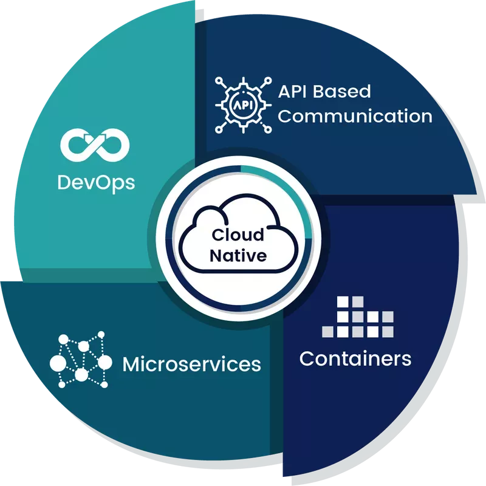
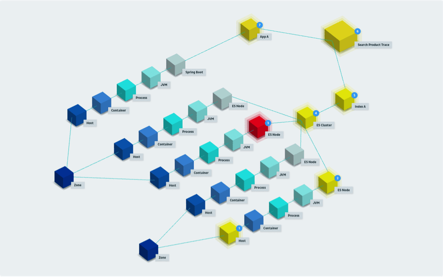
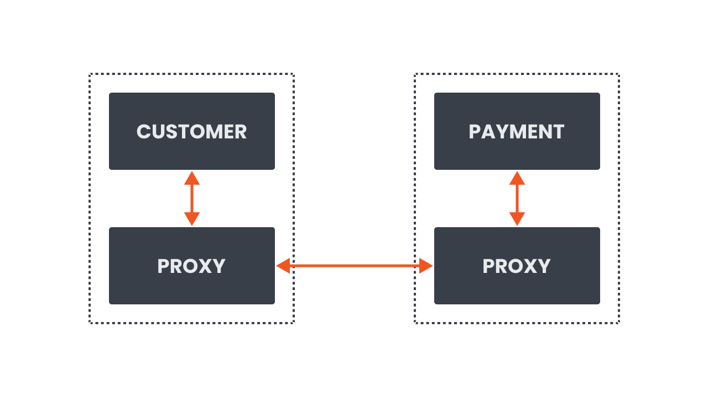
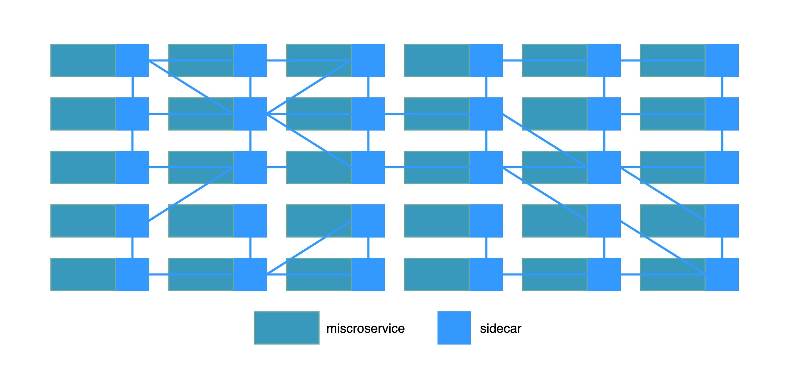
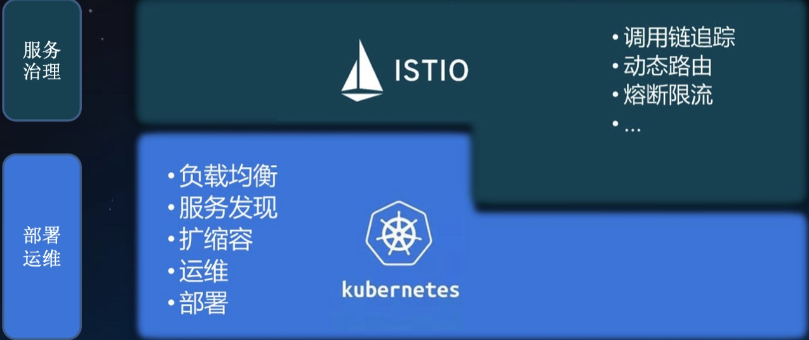
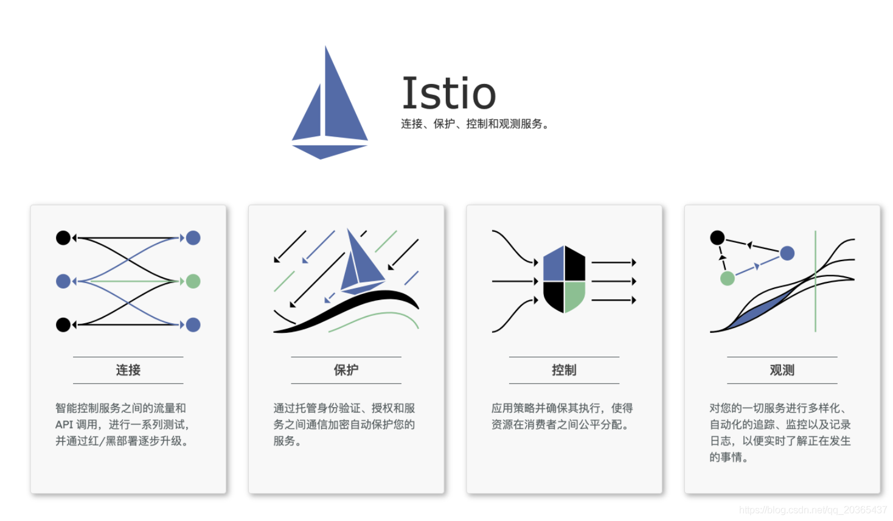

介绍服务网格和Istio相关的生态、概念、架构等
<!--truncate-->
## 1、云原生

云原生的定义：

- 2010年，WSO2技术总监PaulFremantle 首次提出Cloud Native，他一直想用一个词表达一个架构，这种架构能够描述应用程序和中间件能够在云环境中有良好的运行状态。云原生有以下特性 分布式、弹性、多租户，子服务，按需计量和计费，增量部署和测试

- 2013年，Netflix云架构师，Adrian Cockcroft介绍了Netflix在AWS上基于Cloud Native的成功应用，Netflix在AWS上有上万个实例

- 2015年，来自Pivotal的Matt Stine，他的电子书《迁移到云原生应用架构》，他认为单体架构在向云原生架构的演进过程中，需要流程、文化、技术共同变革，该书把Cloud Native描述为一组最佳实践，具体包含如下内容：十二因子，微服务，敏捷基础设施，基于API的协作，反脆弱性

- 2017年，Matt Stine在接受媒体采访时又改了口风，将云原生架构归纳为模块化、可观察、可部署、可测试、可替换、可处理6特质；而Pivotal最新官网对云原生概括为4个要点：DevOps+持续交付+微服务+容器

2015年云原生计算基金会（CNCF）成立，最初把云原生定义为包括：容器化封装+自动化管理+面向微服务。

- CNCF于2018年通过了对云原生重新定义的提案，V1.0的定义如下：

云原生技术有利于各组织在公有云、私有云和混合云等新型动态环境中，构建和运行可弹性扩展的应用。云原生的代表技术包括容器、服务网格、微服务、不可变基础设施和声明式API

这些技术能够构建容错性好、易于管理和便于观察的松耦合系统。结合可靠的自动化手段，云原生技术使工程师能够轻松地对系统作出频繁和可预测的重大变更

云原生的英文原文叫`Cloud Native`，从英文的角度来理解，`Native`表示与生俱来，就是亲生的，把`Cloud `和`Native`放到一起又该如何理解？详细的解释是：应用原生被设计为在云上以最佳方式运行，充分发挥云的优势，享受云的特点

云原生这个词看起来比较新鲜，其实从开发人员的角度来理解是很简单的，就是应用在开发的时候就考虑到云上提供的各种服务，充分利用云的动态调度、自恢复、通过`API`访问服务等基本特性，以及敏捷高效的特性。传统的应用开发方式都是闷头开发，不管应用跑在哪个基础设施环境中，也不用考虑基础设施提供的各种能力，让应用能正常运行就好

上面都是从广义上来理解云原生，有点空洞，对应到具体的方法论就是大家耳熟能详的三板斧

- 容器化

- 微服务

- DevOps

## 2、微服务架构

微服务或微服务架构是一种架构风格，它将一个应用程序构建为服务的集合。松散耦合的微服务集合提供了与单个单体应用相同的功能，但有额外的优势。微服务可以独立于其他服务进行开发和部署。它们是围绕业务能力组织的，由较小的团队拥有。它们在部署/开发中更小、更独立，可以更好地维护和测试

开发人员经常将云原生应用程序分解为多个执行特定动作的服务。例如，可能有一个只处理客户的服务和另一个处理订单或付款的服务。所有这些服务都通过网络相互沟通。如果一个新的付款需要被处理，请求会被发送到付款服务。如果客户数据需要更新，请求会被发送到客户服务等等

这种类型的架构被称为微服务架构。这种架构有几个好处。可以有多个较小的团队从事个别服务。这些团队可以灵活地选择他们的技术栈和语言，并且通常有独立部署和发布服务的自主权。这种机制得以运作得益于其背后通信网络。随着服务数量的增加，它们之间的网络通信也在增加。服务和团队的数量使得监控和管理通信逻辑变得相当复杂。由于我们也知道网络是不可靠的，它们会失败，所有这些的结合使得微服务的管理和监控相当复杂

## 3、Kubernetes

`Kubernetes`是现代基于容器的`DevOps`和微服务以及容器携手并进的黄金标准，其设计之初就是按照云原生的理念设计的

`Kubernetes`是一款用于管理容器化工作负载和服务的可移植、可扩展的开源平台，拥有庞大、快速发展的生态系统，它面向基础设施，将计算、网络、存储等资源进行紧密整合，为容器提供最佳运行环 境，并面向应用提供封装好的、易用的工作负载与服务编排接口，以及运维所需的资源规格、弹性、运行参数、调度等配置管理接口，是新一代的云原生基础设施平台。 从平台架构而言，`Kubernetes`的设计围绕平台化理念，强调插件化设计与易扩展性，这是它与其他同类系统的最大区别之一，保障了对各种不同客户应用场景的普遍适应性。另外，`Kubernetes`与其他容器编排系统的显著区别是`Kubernetes`并不把无状态化、微服务化等条件作为在其上可运行的工作负载的约束

随着互联网的发展，后端服务和容器编排技术的日益成熟，微服务成为了后端服务的首选，`Kubernetes`也已成为目前容器编排的事实标准

## 4、服务网格

服务网格被定义为一个专门的基础设施层，用于管理服务与服务之间的通信，使其可管理、可见、可控制。在某些版本的定义中，可能还会听到服务网格如何使服务间的通信安全和可靠。用一个更直接的句子来描述服务网格：服务网格是关于服务之间的通信

但是，服务网格是如何帮助通信的呢？让我们思考一下通信逻辑和它通常所在的地方。在大多数情况下，开发人员将这种逻辑作为服务的一部分来构建。通信逻辑是处理入站或出站请求的任何代码，重试逻辑，超时，甚至可能是流量路由。因此，无论何时服务`A`调用服务`B`，请求都要经过这个通信代码逻辑，这个逻辑决定如何处理这个请求

如果我们采用微服务的方法，最终可能会有大量的服务。我们如何处理所有这些服务的通信逻辑呢？我们可以创建一个包含这种逻辑的共享库，并在多个地方重用它。假设我们对所有的服务都使用相同的堆栈或编程语言，共享库的方法可能会很有效。如果我们不这样做，我们将不得不重新实现这个库，这会带来巨大的工作量而且效率低下。你也可能使用自己本身不拥有代码库的服务。在这种情况下，我们无法控制通信逻辑或监控

另外一个问题是配置。除了配置你的应用程序外，我们还必须维护通信逻辑配置。如果我们需要同时调整或更新多个服务，我们将不得不为每个服务单独进行调整

服务网格所做的是，它将这种通信逻辑、重试、超时等从单个服务中分离出来，并将其移到一个单独的基础设施层。在服务网格的情况下，基础设施层是一个网络代理的阵列。这些网络代理的集合（每个服务实例旁边都有一个）处理你的服务之间的所有通信逻辑。我们称这些代理为`sidecar`，因为它们与每个服务并存

我们让`Customer`服务直接与`Payment`服务通信，现在我们有一个`Customer`服务旁边的代理与`Payment`服务旁边的代理通信。服务网格控制平面以这样一种方式配置代理，即它们透明地拦截所有入站和出站请求。这些代理的集合（基础设施层）形成了一个网络网格，称为服务网格

将通信逻辑从业务和应用逻辑中分离出来，可以使开发人员专注于业务逻辑，而服务网格运维人员则专注于服务网格配置

因此，用到服务网格`sidecar`模式后，应用的拓扑可能是这样

服务网格为我们提供了一种一致的方式来连接、保护和观察微服务。网格内的代理捕获了网格内所有通信的请求和指标。每一次失败、每一次成功的调用、重试或超时都可以被捕获、可视化，并发出警报。此外，可以根据请求属性做出决定。例如，我们可以检查入站（或出站）请求并编写规则，将所有具有特定头值的请求路由到不同的服务版本

## 5、Istio

`Istio`是服务网格技术云原生`Cloud Native`时代的产物，是云原生应用的新型架构模式，而云原生又是云计算产业发展的新制高点

`2016`年，`Google`决定开发一个对微服务进行管理的开源项目，它与`Google`内部使用的平台有很大的相似性，该项目被命名为`Istio`,`Istio`在希腊语中的意思是“启航”。就在`Google`启动`Istio`项目的几乎同一时间，`IBM`也发布了一个名为`Amalgam8`的开源项目，这是一个基于`Nginx`代理技术，为微服务提供基于内容路由方案的项目。随后，`Google`和`IBM`意识到这两个项目在使用场景与产品愿景上存在很大一部分交集，于是答应成为合作伙伴，`IBM`放弃`Amalgam8`的开发，与`Google`共同基于`Lyft`公司开源的`envoy`项目打造`Istio`这款产品

`Istio`是一个与`Kubernetes`紧密结合的适用于云原生场景的`Service Mesh`形态的用于服务治理的开放平台

`Istio`与`Kubernetes`的关系如下

`Istio`的出现将服务网格的概念发扬光大，它创新性地将服务网格从逻辑上划分为“数据面板”和“控制面板

- 随着分布式应用一起部署的`sidecar`成为数据平面，它能够拦截网络请求并控制服务之间的通信

- 而集中式的管理模块成为控制平面，它提供服务发现、流量管理、遥测数据收集以及证书轮换等功能

在整个网络里面，所有的流量都在`sidecar`代理的控制当中，所有的`sidecar`代理都在控制面板控制当中，因此，可以通过控制面板控制整个服务网格，这是`Istio`带来的最大革新

`Istio`提供一种简单的方式来为已部署的服务建立网络，该网络具有负载均衡、服务间认证、监控等功能，只需要对服务的代码进行一点或不需要做任何改动，让服务支持`Istio`，只需要在环境中部署一个特殊的`sidecar`代理，使用`Istio`控制平面功能配置和管理代理，拦截微服务之间的所有网络通信

- HTTP、gRPC、WebSocket 和 TCP 流量的自动负载均衡

- 通过丰富的路由规则、重试、故障转移和故障注入，可以对流量行为进行细粒度控制

- 可插入的策略层和配置 API，支持访问控制、速率限制和配额

- 对出入集群入口和出口中所有流量的自动度量指标、日志记录和追踪

- 通过强大的基于身份的验证和授权，在集群中实现安全的服务间通信

本文就写（参考）到这里，后面围绕`Istio`做更多学习、实践的分享

See you ~

> 参考
> https://istio.io/latest/zh/docs/concepts/what-is-istio/
> https://www.infoq.cn/article/fA42rfjV*dYGAvRANFqE
> https://mp.weixin.qq.com/s/csY8T02Ck8bnE3vVcZxVjQ