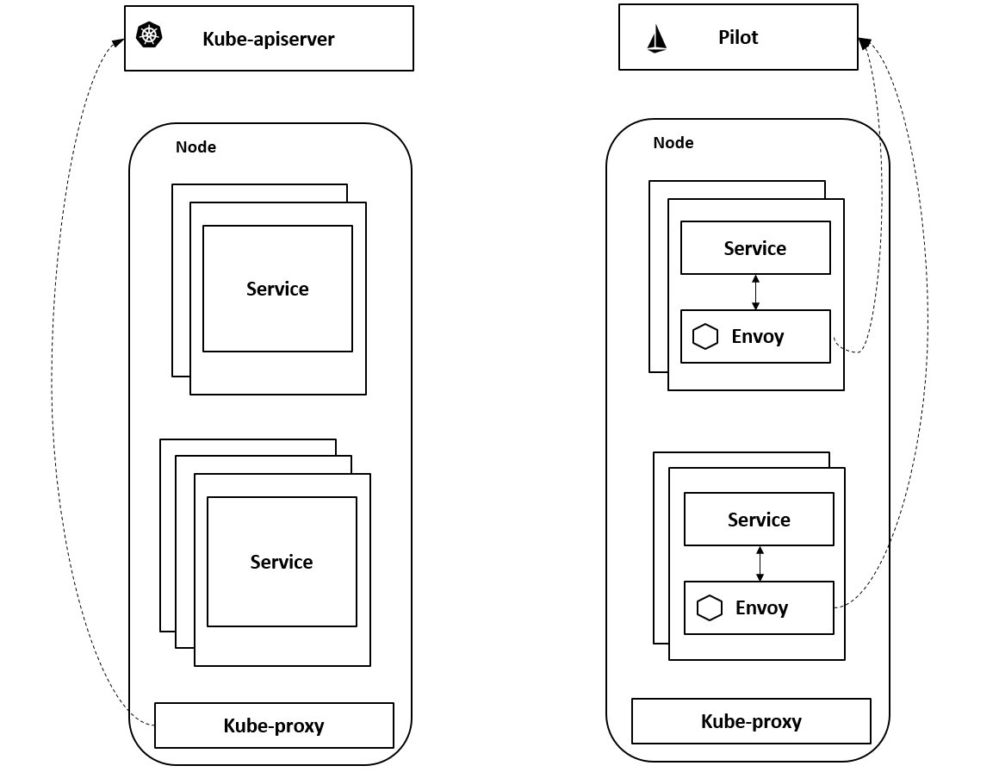
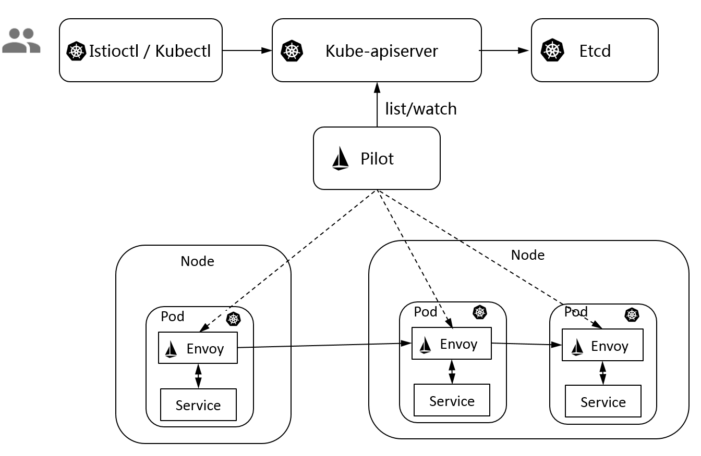
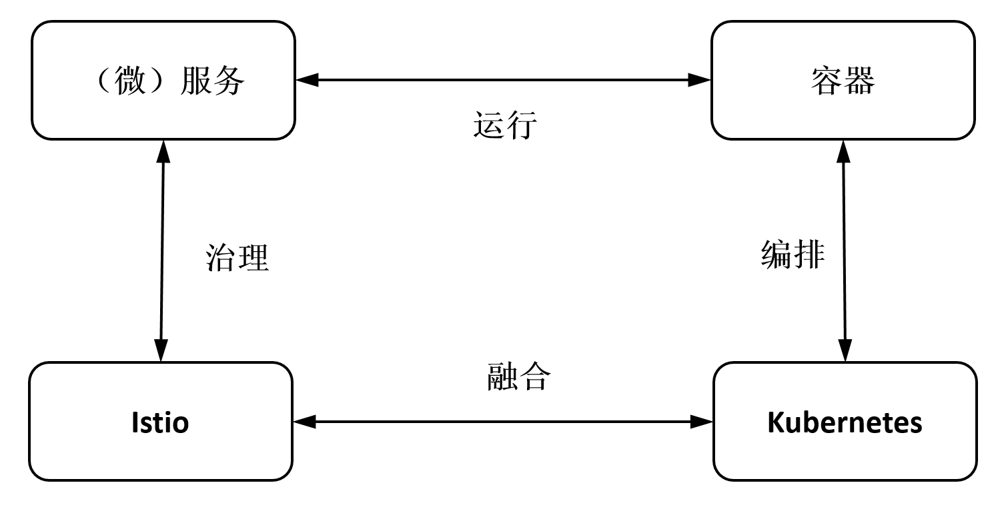

本文是[服务网格和Istio初识](https://www.ssgeek.com/blog/fu-wu-wang-ge-he-istio-chu-shi/)的续篇内容，主要是漫谈(记录)一些关于服务网格、`Istio`的一些理论及个人认知
<!--truncate-->
> 为什么还要写这类看似枯燥的文章？我始终认为，学习和实践应用一门新技术之前，应该做好多方调研，全局认知，当前有什么痛点能解决而不是有哪些功能能拿来用等等，到最后不至于仅仅是用了起来而已

## 1、服务治理的三种形态

服务治理的发展经过了以下三种形态的演进

- 应用程序中包含治理逻辑（代码自行实现，复用性很低）
- 治理逻辑独立的代码（`sdk`方式，提高复用性，但避免不了的是要应用一起打包部署）
- 治理逻辑独立的进程（`sidecar`模式，对应用无感知，解耦合）

## 2、服务网格的特点

- 基础设施：服务网格是一种处理服务间通信的基础设施层
- 云原生：服务网格尤其适用于在云原生场景下帮助应用程序在复杂的服务拓扑间可靠地传递请求
- 网络代理：在实际使用中，服务网格一般是通过一组轻量级网络代理来执行治理逻辑的
- 对应用透明：轻量网络代理与应用程序部署在一起，但应用感知不到代理的存在，还是使用原来的方式工作

## 3、网格带来的损耗

传统环境下，服务`A`到服务`B`可以直接通过网络（`ip`或服务名）直连

用了网格后，从`A`服务到`B`服务的一个访问必须要经过`A`服务的`Sidecar`拦截`Outbound`流量执行治理动作；再经过`B`服务的`Sidecar`拦截`Inbound`流量，执行治理动作。 这就引入两个问题：

- 增加了两处延迟和可能的故障点
- 多出来的这两跳对于访问性能、整体可靠性及整个系统的复杂度都带来了新的挑战

通过保证转发代理的轻量和高性能降低时延影响，尤其是考虑到后端实际使用的应用程序一般比代理更重，叠加代理并不会明显影响应用的访问性能；另外，对于这些高性能的代理，只要消耗足够的资源总能达到期望的性能， 特别是云原生场景下服务的弹性特点使得服务实例的弹性扩展变得非常方便，通过扩展实例数量总是能得到期望的访问性能

因此最终需要决策的是：
是否愿意花费额外的少量资源在这些基础设施上来换取开发、运维的灵活性、业务的非侵入性和扩展性等便利？

## 4、为什么服务网格选择Istio

- 控制面设计

`Istio`作为一种全新的设计，在功能、形态、架构和扩展性上提供了远超服务网格的能力范围。它基于`xDS`协议提供了一套标准的控制面规范，向数据面传递服务信息和治理规则。`Istio`的早期版本使用`Envoy V1`版本的`API`，即`Restful`方式，其新版本使用`Envoy V2`版本的`API`，即`gRPC`协议。标准的控制面`API`解耦了控制面和数据面的绑定。`Nginx`的`nginMesh`、`F5 Networks`的`Aspen Mesh`等多种数据面代理支持`Istio`的控制面，甚至有些老牌微服务`SDK`也开始往`Istio`上集成

- 数据面设计

`Istio`的标准数据面`Envoy`是由`Lyft`内部于`2016`年开发的，比`Linkerd`更早。`2016`年`9`月，`Envoy`开源并发布了`1.0.0`版本；`2017`年`9`月，`Envoy`加入`CNCF`，成为第`2`个`Service Mesh`项目；`2018`年`11`月，`Envoy`从`CNCF`毕业，这标志着其趋于成熟。从开发语言上看，`Envoy`是使用`C++`开发的，其性能和资源占用比用`Rust`开发的`Linkerd Proxy`要更好，更能满足服务网格中对透明代理的轻量高性能要求；从能力上看，`Envoy`提供`L3/L4`过滤器、`HTTP L7`过滤器，支持`HTTP/2`、`HTTP L7`路由及`gRPC`、`MongoDB`、`DynamoDB`等协议，有服务发现、健康检查、高级`LB`、前端代理等能力，具有极好的 可观察性、动态配置功能；从架构实现上看，`Envoy`是一个可高度定制化的程序，通过`Filter`机制提供了 高度扩展性，还支持热重启，其代码基于模块化编码，易于测试。除了在`Istio`中应用，`Envoy`在其他`Service Mesh`框架中也被广泛应用，渐渐成为`Service Mesh`的数据平面标准

- 大厂加持

`Istio`由谷歌和`IBM`共同推出，从应用场景的分析规划到本身的定位，从自身架构的设计到与周边生态的结合，都有着比较严密的论证。`Istio`项目在发起时已经确认了将云原生生态系统中的容器作为核心打包和运行时，将`Kubernetes`作为管理容器的编排系统，需要一个系统管理在容器 平台上运行的服务之间的交互，包括控制访问、安全、运行数据收集等，而`Istio`正是为此而生的；另外，`Istio`成为架构的默认部分，就像容器和`Kubernetes`已经成为云原生架构的默认部分一样

另外一点，很多的公有云厂商在提供`kubernetes`容器服务时也内置了`Istio`功能或者二次开发（包装）了`Istio`，例如阿里云的`asm`

## 5、Istio与kubernetes

`Istio`和`Kubernetes`从设计理念、使用体验、系统架构甚至代码风格等小细节来看，关系都非常紧密。更细粒度的proxy提供更多更细粒度的能力

`Istio`最大化地利用了`Kubernetes`这个基础设施，与之叠加在一起形成了一个更强大的用于进行服务运行和治理的基础设施，并提供了更透明的用户体验。

- 数据面

数据面`Sidecar`运行在`Kubernetes`的`Pod`里，作为一个`Proxy`和业务容器部署在一起。在服务网格的定义中要求应用程序在运行的时候感知不到`Sidecar`的存在。而基于`Kubernetes`的一个`Pod`多个容器的优秀设计使得部署运维对用户透明，用户甚至感知不到部署`Sidecar`的过程。用户还是用原有的方式创建负载，通过`Istio`的自动注入服务，可以自动给指定的负载注入`Proxy`。如果在另一种环境下部署和使用`Proxy`，则不会有这样的便利

- 统一服务发现

`Istio`的服务发现机制非常完美地基于`Kubernetes`的域名访问机制构建而成，省去了再搭一个类似`Eureka`的注册中心的麻烦，更避免了在`Kubernetes`上运行时服务发现数据不一致的问题

尽管`Istio`强调自己的可扩展性的重要性在于适配各种不同的平台，也可以对接其他服务发现机制，但在实际场景下，通过深入分析`Istio`几个版本的代码和设计，便可以发现其重要的能力都是基于`Kubernetes`进行构建的

- 基于`Kubernetes CRD`描述规则

`Istio`的所有路由规则和控制策略都是通过`Kubernetes CRD`实现的，因此各种规则策略对应的数据也被存储在`kube-apiserver`中，不需要另外一个单独的`APIServer`和后端的配置管理。所以，可以说`Istio`的`APIServer`就是`Kubernetes`的`APIServer`，数据也自然地被存在了对应`Kubernetes`的`etcd`中

`Istio`非常巧妙地应用了`Kubernetes`这个好基座，基于`Kubernetes`的已有能力来构建自身功能。`Kubernetes`里已经有的，绝不再自己搞一套，避免了数据不一致和用户使用体验的问题

`Istio`不仅数据面`Envoy`跑在`Kubernetes`的`Pod`里，其控制面也运行在`Kubernetes`集群中，其控制面组件本身存在的形式也是`Kubernetes Deployment`和`Service`，基于`Kubernetes`扩展和构建

最后，看看微服务、容器、`Kubernetes`、`Istio`四者的关系

## 6、微服务和Istio的选择侧重

微服务是架构风格、方法论，`Istio`是一套完整的实践

但是，回到我在本文开头提到的一点观念，`Istio`是用来解决问题的，并不是微服务理论的一种落地，在实际项目中拿着微服务的细节列表来硬套`Istio`的功能，比如要求`Istio`治理的服务必须实现微服务的服务注册的一些细节，就明显不太适当

## 7、Istio的侵入性

从单个应用来看，`Sidecar`与应用进程的解耦带来的应用完全无侵入、开发语言无关等特点解除了开发语言的约束，从而极大降低了应用开发者的开发成本。这种方式也经常被称为一种应用的基础设施层，类比`TCP/IP`网络协议栈，应用程序像使用`TCP/IP`一样使用这个通用代理：`TCP/IP`负责将字节码可靠地在网络节点间传递，`Sidecar`则负责将请求可靠地在服务间进行传递。`TCP/IP`面向的是底层的数据流，`Sidecar`则可以支持多种高级协议（`HTTP`、`gRPC`、`HTTPS`等），以及对服务运行时进行高级控制，使服务变得可监控、可管理

从全局来看，在多个服务间有复杂的互相访问时才有服务治理的需求。即我们关注的是这些`Sidecar`组成的网格，对网格内的服务间访问进行管理，应用还是按照本来的方式进行互相访问，每个应用程序的`Inbound`流量和`Outbound`流量都要经过`Sidecar`代理，并在`Sidecar`上执行治理动作

`Sidecar`是网格动作的执行体，全局的管理规则和网格内的元数据维护通过一个统一的控制面实现，只有数据面的`Sidecar`和控制面有联系，应用感知不到`Sidecar`，更不会和控制面有任何联系，用户的业务和控制面彻底解耦

## 8、Istio用在哪

`Istio`是一个服务治理平台，治理的是服务间的访问，只要有访问就可以治理，不在乎这个服务是不是 所谓的微服务，也不要求跑在其上的代码是微服务化的。单体应用即使不满足微服务的若干哲学，用`Istio`治理也是完全可以的

## 9、Istio做了什么

以前后端分离的服务为例
前端 服务的代码中通过域名访问 后端 服务，在两个服务中都不用包含任何服务访问管理的逻辑。`Istio`在其中都做了什么（可以做些什么）

- 自动通过服务发现获取服务实例列表，并根据负载均衡策略选择一个服务实例
- 对服务双方启用双向认证和通道加密
- 如果某个服务实例连续访问出错，则可以将该实例隔离一段时间，以提高访问质量
- 设置最大连接数、最大请求数、访问超时等对服务进行保护
- 限流
- 对请求进行重试
- 修改请求中的内容
- 将一定特征的服务重定向
- 灰度发布
- 自动记录服务访问信息
- 记录调用链，进行分布式追踪
- 根据访问数据形成完整的应用访问拓扑
- ……

所有这些功能，都不需要用户修改代码，用户只需在`Istio`的控制面配置即可，并且动态生效

对业务代码完全没有侵入性

## 10、用什么姿势接入 Istio

虽然`Istio`能解决那么多的问题，但是引入`Istio`并不是没有代价的。最大的问题是`Istio`的复杂性，强大的功能也意味着`Istio`的概念和组件非常多，要想理解和掌握`Istio`，并成功在生产环境中部署需要非常详细的规划。一般情况下，集群管理团队需要对`kubernetes`非常熟悉，了解常用的使用模式，然后采用逐步演进的方式把`Istio`的功能分批掌控下来

- 第一步，自然是在测试环境搭建一套`Istio`的集群，理解所有的核心概念和组件。了解`Istio`提供的接口和资源，知道它们的用处，思考如何应用到自己的场景中，然后是熟悉`Istio`的源代码，跟进社区的`issues`，了解目前还存在的`issues`和`bug`，思考如何规避或者修复。这一步是基础，需要积累到`Istio`安装部署、核心概念、功能和缺陷相关的知识，为后面做好准备

- 第二步，可以考虑接入`Istio`的观察性功能，包括`logging`、`tracing`、`metrics`数据。应用部署到集群中，选择性地（一般是流量比较小，影响范围不大的应用）为一些应用开启`Istio`自动注入功能，接管应用的流量，并安装`prometheus`和`zipkin`等监控组件，收集系统所有的监控数据。这一步可以试探性地了解 `Istio`对应用的性能影响，同时建立服务的性能测试基准，发现服务的性能瓶颈，帮助快速定位应用可能出现的问题。此时，这些功能可以是对应用开发者透明的，只需要集群管理员感知，这样可以减少可能带来的风险

- 第三步，为应用配置`timeout`超时参数、自动重试、熔断和降级等功能，增加服务的容错性。这样可以避免某些应用错误进行这些配置导致问题的出现，这一步完成后需要通知所有的应用开发者删除掉在应用代码中对应的处理逻辑。这一步需要开发者和集群管理员同时参与

- 第四步，和`ingress`、`helm`、应用上架等相关组件和流程对接，使用`Istio`接管应用的升级发布流程。让开发者可以配置应用灰度发布升级的策略，支持应用的蓝绿发布、金丝雀发布以及`AB`测试

- 第五步，接入安全功能。配置应用的`TLS`互信，添加`RBAC`授权，设置应用的流量限制，提升整个集群的安全性。因为安全的问题配置比较繁琐，而且优先级一般会比功能性相关的特性要低，所以这里放在了最后

当然这个步骤只是一个参考，需要根据自己的情况、人力、时间和节奏来调整，找到适合的方案

## 11、Istio不是银弹

`Istio`的架构在数据中心和集群管理中非常常见，每个`agent`分布在各个节点上（可以是服务器、虚拟机、pod、容器）负责接收指令并执行，以及汇报信息；控制中心负责汇聚整个集群的信息，并提供`API`让用户对集群进行管理。`kubernetes`也是类似的架构，`SDN（Software Defined Network）`也是如此。相信以后会有更多类似架构的出现，这是因为数据中心要管理的节点越来越多，我们需要把任务执行分布到各节点（`agent`负责的功能），同时也需要对整个集群进行管理和控制（`control plane`的功能），完全去中心化的架构是无法满足后面这个要求的

`Istio`的出现为负责的微服务架构减轻了很多的负担，开发者不用关心服务调用的超时、重试、`rate limit`的实现，服务之间的安全、授权也自动得到了保证；集群管理员也能够很方便地发布应用（AB 测试和灰度发布），并且能清楚看到整个集群的运行情况

但是这并不表明有了`Istio`就可以高枕无忧了，`Istio`只是把原来分散在应用内部的复杂性统一抽象出来放到了统一的地方，并没有让原来的复杂消失不见。因此我们需要维护`Istio`整个集群，而`Istio`的架构比较复杂，尤其是它一般还需要架在`kubernetes`之上，这两个系统都比较复杂，而且它们的稳定性和性能会影响到整个集群。因此再采用`Isito`之前，必须做好清楚的规划，权衡它带来的好处是否远大于额外维护它的花费，需要有相关的人才对整个网络、`kubernetes`和`Istio`都比较了解才行