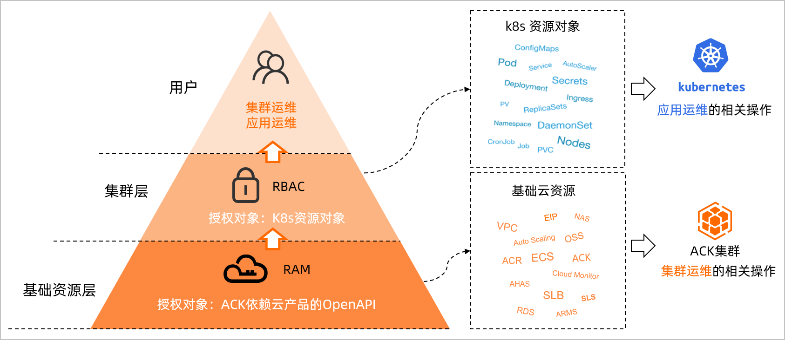
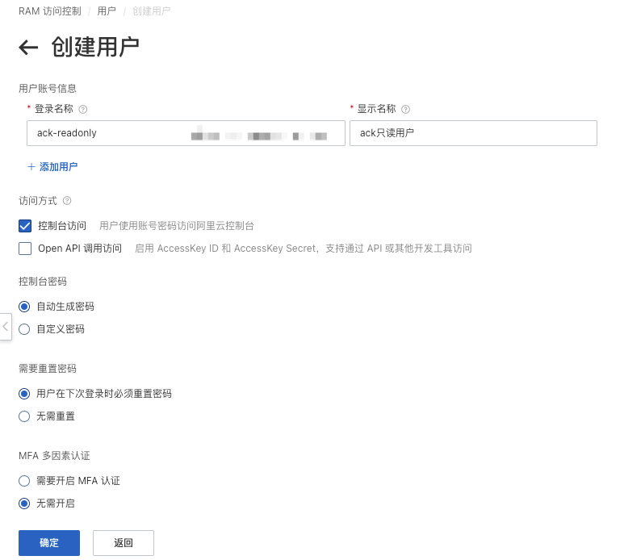
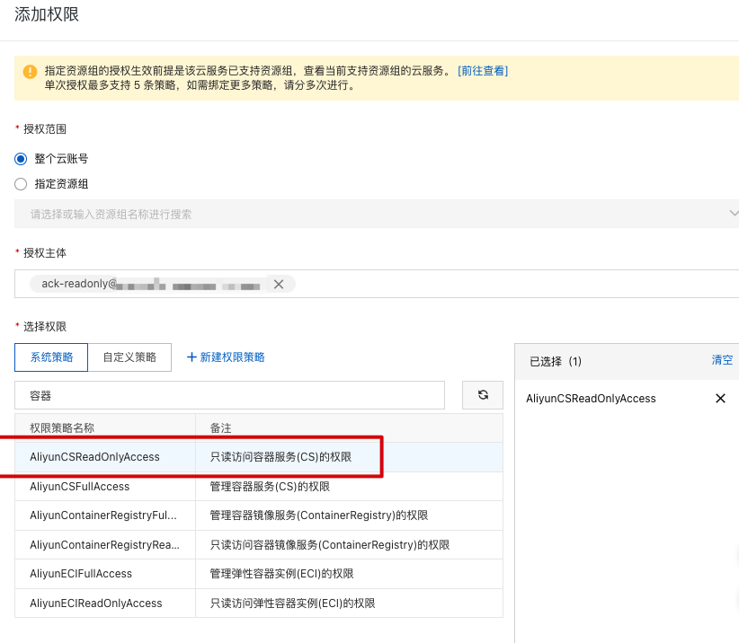
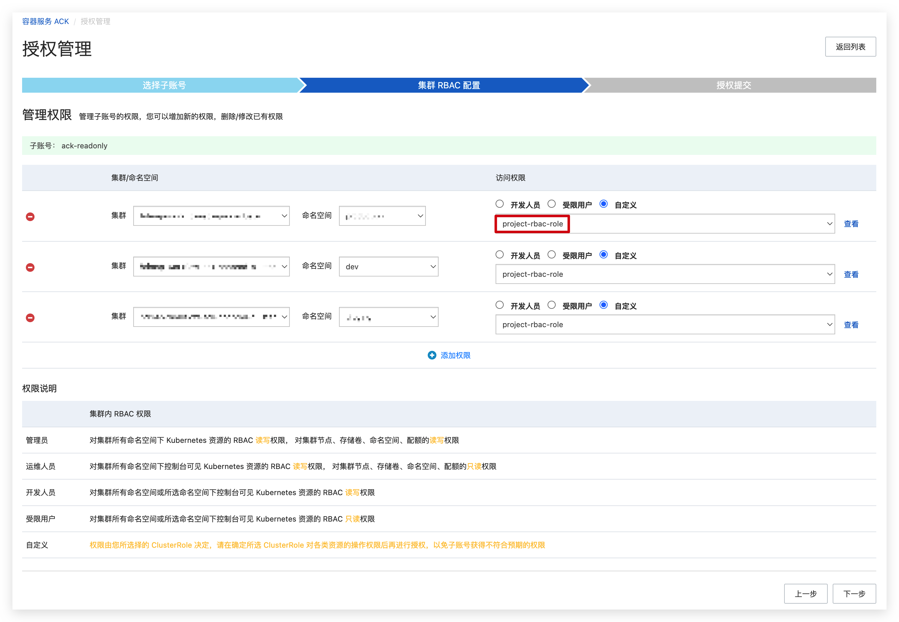

介绍基于阿里云RAM+ACK托管版集群的RBAC授权
<!--truncate-->


## 1、背景

使用阿里云`ack`托管版运行`k8s`集群，有时需要对团队内成员授权集群非管理员的权限，以及某些服务需要调用`k8s`相关`api`做特定操作，例如在指定的某`namespace`下创建某控制器（例如`deployment`）的权限

由于在`ack`托管版环境下，集群的`master`节点由阿里云托管，对租户不可见，因此除了基于`k8s`的`RBAC`权限外，还需要授予阿里云的授权体系，即`RAM`

## 2、授权体系概述

### 2.1 k8s授权体系

先来回忆一下`k8s`的`RBAC`（Role-Based Access Control）基于角色的访问控制授权体系

这是一种很常见并通用的授权体系，在`k8s`中，`RBAC`使用`rbac.authorization.k8s.io` API Group 来实现授权决策

`Kubernetes`从`1.6`版本开始支持`RBAC`，集群管理员可以对用户或服务账号的角色进行更精确的资源访问控制。允许管理员通过`Kubernetes API`动态配置策略，在`RBAC`中，权限与角色相关联，用户通过成为适当角色的成员而得到这些角色的权限。这就极大地简化了权限的管理。在一个组织中，角色是为了完成各种工作而创造，用户则依据它的责任和资格来被指派相应的角色，用户可以很容易地从一个角色被指派到另一个角色


如上图所示，左边对于`Pod`资源的`get`、`list`操作（称为请求动词）类似于常见的`CRUD`，对`k8s`的相关资源操作都是以`REST API`形式发起，每一类请求动词对应`http`请求如下表

| HTTP 动词 | 请求动词                                             |
| --------- | ---------------------------------------------------- |
| POST      | create                                               |
| GET, HEAD | get （针对单个资源）、list（针对集合）               |
| PUT       | update                                               |
| PATCH     | patch                                                |
| DELETE    | delete（针对单个资源）、deletecollection（针对集合） |

`k8s`中的资源和`API Group`关联，不同的资源属于不同的`API Group`，例如`Pod`属于`Core API Group`，`Deployements`属于`apps API Group`

资源操作的集合叫做`Rule`，`RBAC`中的角色，在k8s中分为`Role`和`ClusterRole`，其区别就是前者是命名空间级别下，后者不限命名空间（集群范围内生效）

上图最右边即用户，`k8s`中的`用户`可以分为三类：User、Group、Service Account，`User`即传统意义上的用户，这个用户一般由外部服务管理；`Group`用来关联多个账户；而`Service Account`（服务帐号）就是通过`Kubernetes API`来管理的一些用户帐号，适用于集群内部运行的应用程序。所有的用户称作一个`Subject`

有了角色和用户，就需要两者之间的绑定关系，由于角色有`Role`和`ClusterRole`两类，因此绑定关系也分为`RoleBinding`和`ClusterRoleBinding`，即把声明的`Subject`和想要绑定的`Role`进行绑定（给某个用户绑定上某些操作的权限），二者作用范围和角色类似

### 2.2 阿里云RAM遇上RBAC

如文章封面图所示，`ACK`的授权体系包含对基础资源层的`RAM`授权和对`ACK`集群层的`RBAC`授权两部分

- `RAM`授权对应`ACK`集群的运维操作，需要获取`ACK`产品及其所依赖阿里云云产品的`OpenAPI`操作权限，主要包括以下操作：
  - 集群：创建、查看、升级、删除
  - 节点池：创建、修改、扩缩容
  - 授权管理
  - 集群监控、日志、事件
- `RBAC`授权对应的是运行于`ACK`集群中`Kubernetes`应用的运维操作，需要获取ACK集群及其命名空间的操作权限，主要包括对以下`Kubernetes`对象的增删改查操作：
  - 工作负载：Deployment、StatefulSet、DaemonSet、Job、CronJob、Pod、ReplicaSet、HPA等
  - 网络：Service、Ingress、NetworkPolicy等
  - 存储：PV、PVC、StorageClass等
  - Namespace、ConfigMap 、Secrets等

因此当`RAM`用户或`RAM`角色需要进行集群运维和应用运维时，需要依次对其进行`RAM`授权和`RBAC`授权

对于`RAM`这里不再深入，因为阿里云`RAM`关联了很多很多不同的云产品统一进行授权，因此很复杂，也不做过多研究

## 3、授权过程

上面对阿里云`RAM`和`k8s`的`RBAC`两个体系做了简要介绍和回顾，接下来根据一个实际场景简要介绍授权的整个过程以及需要注意的踩坑点

需求如下：

研发或集群外服务需要操作某集群，例如`dev`（开发）`ack`集群，具有`dev`命名空间的创建、删除`deployment`、`service`、`ingress`这三类资源的权限

若服务在集群内，那么就可以通过`ServiceAccount`方式，假设服务在集群外，目的是要生成一个给`kubectl`使用的`config`文件

### 3.1 创建RAM用户并授权

由于用户最终只能通过控制台才能获取`config`文件，因此需要创建一个可以登录控制台，并对`ack`具有只读权限的用户



然后对用户进行授权，记录下用户的密码



### 3.2 ACK集群中创建ClusterRole

在集群中创建相关授权通常是通过编写对应的`yaml`资源清单

这里推荐一个图形化的工具`Permission manager`，是一个简单便捷的`RBAC`管理界面工具，支持通过`web`界面创建用户，分配`Namespace`权限，并可以生成`kubeconfig`文件，项目地址https://github.com/sighupio/permission-manager

前面需求提到是指定命名空间下的权限，但这里是创建`ClusterRole`而不是`Role`，这个问题后面解释

`ClusterRole`的内容如下

```yaml
kind: ClusterRole
apiVersion: rbac.authorization.k8s.io/v1
metadata:
  name: project-rbac-role
rules:
  - apiGroups: ["extensions", "apps"]
    resources: ["deployments"]
    verbs: ["create", "delete"]
  - apiGroups: [""]
    resources: ["service"]
    verbs: ["create", "delete"]
  - apiGroups: ["networking.k8s.io"]
    resources: ["ingress"]
    verbs: ["create", "delete"]

```

使用`kubectl`进行创建

```shell
➜  rbac git:(master) ✗ kubectl apply -f clusterrole.yaml
```

### 3.3 控制台授权绑定

在`ack`的控制台对`ram`用户授权，点击到某个集群——>安全管理——>授权，选择上面创建的`ram`子账号，点击“管理权限”，选择集群（这里虽然已经进入到了特定集群，但依然可以选择其他集群，或许是`ack`产品设计上有点不合理），选择对应要授权的命名空间，访问权限选择“自定义”，然后下拉就能找到上面创建的名为`project-rbac-role`的`ClusterRole`

上面提到了创建`ClusterRole`而不是`Role`，原因就在这里，因为这里下拉只能读取到集群中存在的`ClusterRole`，选择完成后点击下一步，授权成功



那么，既然已经使用了`ClusterRole`，又选定了命名空间，因此相当于还是基于`Role`的权限？

没错，实际上这里的操作是对应的在`ack`集群中创建了一个`Rolebinding`绑定集群的`ClusterRole`，正常来说应该是`Rolebinding`绑定集群的`Role`，`ClusterRolebinding`绑定集群的`ClusterRole`，这里相当于交叉绑定了，但实际上这个`ClusterRole`的权限范围缩小了

可以通过如下方式查看集群中的`Rolebinding`，名称大致为“ram用户的uid-命名空间-clusterrole的名称-rolebinding”，关联的`subjects`用户正是`ram`用户的`uid`

```shell
➜  rbac git:(master) ✗ kubectl get rolebinding -n dev|grep 29xxxxxxxxxxx1
29xxxxxxxxxxx1-dev-project-rbac-role-rolebinding   ClusterRole/project-rbac-role    41m
➜  rbac git:(master) ✗ kubectl -n dev get rolebinding 29xxxxxxxxxxx1-dev-project-rbac-role-rolebinding -o yaml|kubectl neat
apiVersion: rbac.authorization.k8s.io/v1
kind: RoleBinding
metadata:
  name: 29xxxxxxxxxxx1-dev-project-rbac-role-rolebinding
  namespace: dev
roleRef:
  apiGroup: rbac.authorization.k8s.io
  kind: ClusterRole
  name: project-rbac-role
subjects:
- apiGroup: rbac.authorization.k8s.io
  kind: User
  name: "29xxxxxxxxxxx1"
```

到这里授权就完成了

### 3.4 获取连接集群的config

用上面创建的`readonly`这个`ram`用户登录到`ack`的每个集群控制台，获取这个`ram`用户的集群连接信息即`config`内容，保存成文件即可

## 4、小结

使用`ack`托管版对集群授权需要关联`ram`用户和集群`RBAC`的`ClusterRole`，无需在集群中手动创建其他资源，整个过程中有一定的小坑和个人感觉设计不太合理的地方仅供参考~


See you ~

### 参考资料

https://kubernetes.io/zh/docs/reference/access-authn-authz/authorization/

https://help.aliyun.com/document_detail/119596.html