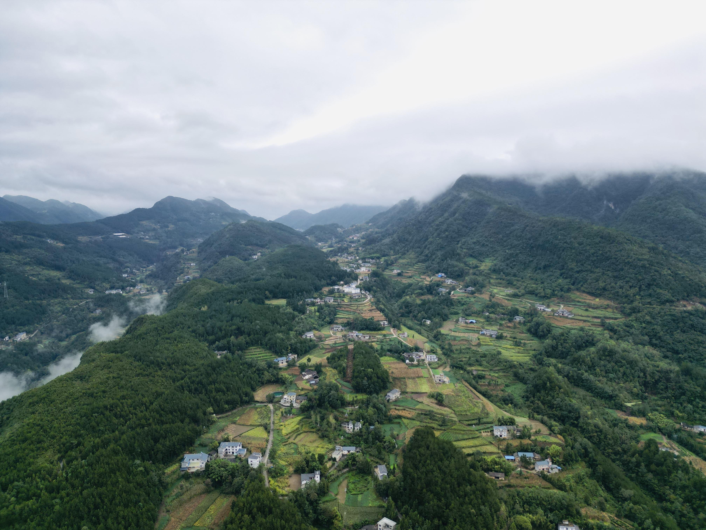

2022-2023年度总结
<!--truncate-->

## 开篇

“许多人迷迷糊糊，光阴虚度，尽管眼见已二三十岁，却仍旧活在生活之下，即便多活几十年，也不过是一种窘困，愁苦，凡庸的延伸，着实冤枉”

“复以何因缘，得大坚固力，人世间的一切都不牢靠、不坚固，寿命，也是不坚固的，顶多活一百年来年就要走了。家庭、父母、子女、夫妇相聚都不坚固，终归要分散的。佛经上经常有一句话：积聚必消散。聚拢的因缘完了，统统要分散。发了财，钞票来了，终归有不发财的一天，钱也有消散的一天。权力拿到手，总会有失掉的一天。房子建筑起来也总会有毁坏的一天。世界上有没有一个东西是坚固不破的”

上述是近期看到的一些文字，不再年轻的我，深有感触

时光如箭，岁月如梭，时间与命运的齿轮依然保持着不停转动。转眼间，两年的时光已在指尖溜走。若说时间是艺术家，那么它绘制的线条既粗犷又细腻，每一笔都描绘着成长与变迁

## 回首

2022-2023 是来北京的第4、5个年头，也是本科毕业的第3、4年。过去的两年，个人成长与所遇之事，对我而言充满了不平凡

还记得22年的年底，疫情在正当严重时突然放开，在此之前人们好像都已习惯了没有固定频率的核酸，习惯了健康宝与行程码。忽然间这股弦就松开了，生活也立马回到了19年疫情前的样子，伴随着的是令人“阳了”的痛苦以及生命的逝去

这两年完成的最大一件事情，就是人生角色的转变——我结婚了。两年里，从22年春节双方父母见面，到23年春节的订婚，再到23年国庆的婚礼，感恩父母，感恩爱人，成就了我们的小家

两年里拥有了几本新的证书，算是对自己这两年变化的一个证明

## 工作

从上一篇年终总结[2021 总结与公众号文章回顾]的时间点，就到现在的公司任职，如今也已经两年过去了

两年中经历与推动了不少从零开始的工作内容，自身能力、经验等各方面也得到了一些历练与长进，具体内容这里就不过多展开了

## 生活

生活上认真听取了另一半的建议，不再像之前刚毕业时的宅，调整一个相对较好的自我状态。关于状态的自我剖析与调整有兴趣的朋友可以找找之前的文章。现在看来，这是一个打工人必会经历的心路历程

在保持健康饮食的同时，更爱在休息时间和另一半走出出租屋，打卡各店美食（实际上是薅🐑毛）

在22年初有了一台代步车，于是这两年每逢假期基本都会回家看看或是出去走走，享受在路上的感觉，享受出发与抵达。不到两年的时间里，总里程已经达到了约2.7w公里，期望来年伴随着四个车轮行至更多好去处

## 学习

得益于在公司的环境和产出，这两年个人技能在前后端、架构，以及底层等方面都有了更为深入的认知与提升

计算机技术范围广泛且发展迅速，能够学以致用，解决实际问题，发挥与创造一些新的事物，这是技术从业者最大的价值体现，与此同时得到了正向反馈，才会更加精进

这些道理亦在为人处世上发挥关键作用

## 爱好

公路车骑行的习惯依然保留，每年平均保持在约5000km的记录

在23年初购入了一台[DJI Mini 3 Pro](https://www.dji.com/mini-3-pro)，解锁了新的爱好，拍摄了一些对于入门选手还算可以的作品

感兴趣的朋友可以加微信围观朋友圈，一起交流、约骑

## 博客与公众号

博客是在大学期间开始折腾，微信公众号是在21年初开通同步发文

有些遗憾的是这两年由于工作生物钟、个人事务、拖沓等种种原因，导致博客与公众号都停更了很久

当初写文的出发点更多一方面是为了不断提升自我，从输出倒逼输入，记录一些自己在技术领域的路线，究其根本，还是自己没有平衡好一天的时间，有些产出早已拟好标题与关键内容，就是迟迟没有动笔，在这里做出自我检讨

希望新的一年还是能继续捡起写文章的好习惯

另外一方面也会更多分享个人生活，或许多年后还能有人寻着互联网的记忆找到这里

不过这两年里，关注的公众号中，之前有很多产出的一些号主，几乎很少有在坚持写文的了。我想这不仅和自身有关，印象中之前公众号是一块很纯净的地方，现如今微信公众号的浏览页面中已经沦为广告、推广、标题党、新闻八卦无脑推文的地方

我曾经每天愿意花大量时间挨篇仔细品读公众号的文章，现在也只是从少量收藏了名字的号中挑选阅读，看是否有好文诞生

以至于我花了一定时间尝试关闭/不接受任何公众号区域推送**未关注**的号内容，无奈在微信“个性化广告管理”菜单中说明：“智能推荐你可能感兴趣的广告内容，你可以开启或关闭服务，或管理广告兴趣标签，但广告总数**不会因此变化**”

简单理解，就是你可以设置关闭，然并luan，对此我只能说，tx会玩，罢了

## 最后

我将朋友圈签名修改为“做有趣的人，做有意思的事”，这是在毕业后对于人生的思考

希望大家在现今纷繁复杂的社会环境中，远离“海燕综合征”，活出自我与真实

同时，对各位老粉丝与朋友的支持表示真心感谢

新的一年继续保持，挑战更多，人生在于折腾！

最后，附上上述总结相关的一些视频，供日后回忆与大家品鉴
