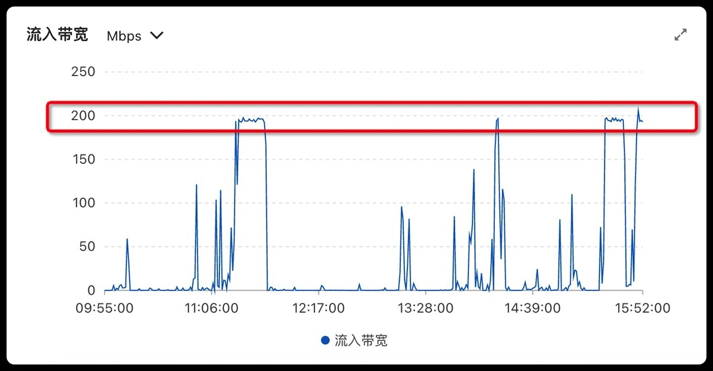
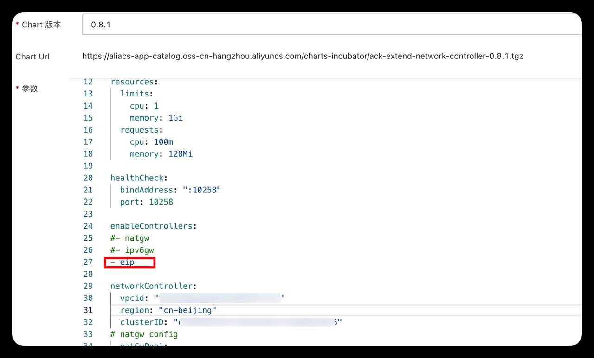
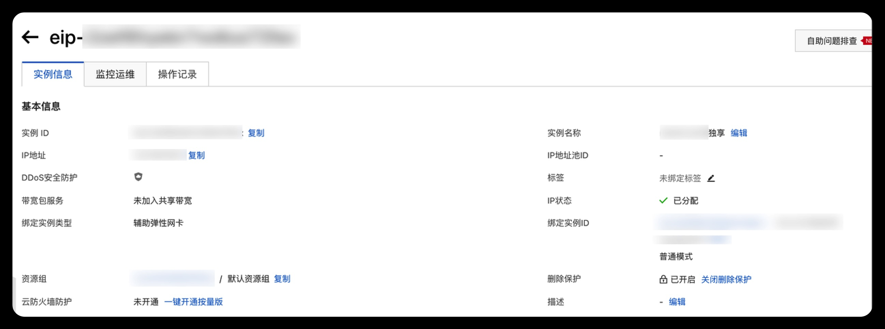
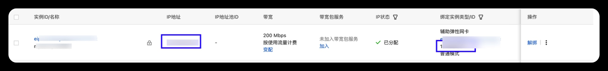

引入一个实际生产环境案例，介绍在阿里云Ack集群中如何实现Pod独占公网EIP
<!--truncate-->
## 1. 背景

某线上应用部署在`ack`集群内，用于根据用户定义的`http`请求项配置，周期性检查`http`接口的请求响应状态，接口地址为内网或公网，当接口地址为公网时，频繁出现请求超时的报警错误。经过排查发现，在公网请求发生超时的时刻，集群`vpc NAT`带宽达到上限`200Mbps`，也就是`25MB/s`




分析：由于集群占用`vpc`，`vpc`内所有`ip`（node和pod的ip）都属于`vpc`内各子网地址，这些地址出公网的请求共用`vpc`绑定的公网`NAT`，在某时刻子网`ip`请求公网使用的`EIP`是随机的，无法控制，会产生和其他`ip`同时请求公网使用同一个`EIP`的情况，由此发生了带宽内拥挤，超限的情况，因此上述超时报警其实是**客户端带宽不够产生的误报**

## 2. 解决方案

为了避免发生上述情况，解决办法是避免这些特定的pod请求公网时和其他ip发生公网带宽的争抢，走独立的公网出口，有以下两种方案：

- 方案一

将这些`pod`调度到特定的子网`node`，`node`的`ip`和`pod`的`ip`会使用特定的子网，这个特定的子网由于在特定的`vSwitch`虚拟交换机下，因此可以为这个子网单独指定路由条目，也就是将请求公网地址的请求的下一跳路由到特定的公网`NAT`，特定的公网`NAT`使用特定的`EIP`且不和其他子网共用

- 方案二

`ack`集群的网络使用的是阿里云`Terway`，在此前提下，阿里云提供了[为Terway网络中的Pod挂载独立的公网EIP](https://help.aliyun.com/zh/ack/ack-managed-and-ack-dedicated/user-guide/associate-an-eip-with-a-pod-1#95a64c02c0f05)的解决方案，具体可以查看文档说明，简单来说就是**阿里云提供了集群内的控制器，实现了通过k8s原生的声明式配置，调用EIP产品相关api动态为pod绑定EIP的功能**


## 3. 方案选取和实现

方案一，改动较大，需要将`pod`调度到特定的`node`上，且需要人工维护路由条目，维护性较差；
方案二，更为直接，在安装控制器插件后，通过给`pod`添加特定注解实现目的，主要分为两种方式：
- 一种是根据声明式配置动态随机购买EIP

```yaml
apiVersion: apps/v1
kind: Deployment
metadata:
  name: example
  labels:
    app: example
spec:
  replicas: 1
  selector:
    matchLabels:
      app: example
  template:
    metadata:
      labels:
        app: example
      annotations:
        k8s.aliyun.com/pod-with-eip: "true"  # 自动创建并绑定EIP
        k8s.aliyun.com/eip-bandwidth: "200"  # EIP峰值带宽
        k8s.aliyun.com/eip-internet-charge-type: "PayByTraffic" # EIP的计量方式
        k8s.aliyun.com/eip-instance-charge-type: "PostPaid"  # EIP的计费方式
        k8s.aliyun.com/eip-name: "app-eip"  # EIP名称
        k8s.aliyun.com/eip-description: "app-eip"  # EIP描述
```

- 一种是先购买EIP，pod注解中声明EIP的id

```yaml
apiVersion: apps/v1
kind: Deployment
metadata:
  name: example
  labels:
    app: example
spec:
  replicas: 1
  selector:
    matchLabels:
      app: example
  template:
    metadata:
      labels:
        app: example
      annotations:
        k8s.aliyun.com/pod-eip-instanceid: eip-2zeXXXXXx  # EIP ID
```

### 3.1 配置RAM策略并安装插件

按照文档操作，配置挂载EIP所需的RAM权限
安装插件`ack-extend-network-controller`，安装时启用插件`pod eip`的能力，一键安装即可



### 3.2 购买EIP

由于业务目前只有`1`个`pod`，为了后续排查方便，选择通过先购买`EIP`再根据`EIP id`绑定的方式
购买`EIP`，按量付费，带宽上限为`200Mbps`



### 3.3 为pod添加注解

在`deployment`的`yaml`中为`pod`添加注解，根据`EIP id`绑定这个`EIP`即可

```yaml
spec:
  template:
    metadata:
      annotations:
        k8s.aliyun.com/pod-eip-instanceid: eip-xxx
```

绑定后效果
- 集群cr

控制器会自动创建一个和`pod`名称相同的`PodEIP`的`cr`，从这个`cr`的`status`中可以看到和上面购买的`EIP`相关的信息

```yaml
~ kubectl get pods -o wide|grep app
app-79dcf755fb-ks2ld                                       1/1     Running             0                47h     10.245.36.4      ack-010245035222packets-spot       <none>           1/1
~ kubectl get podeips app-79dcf755fb-ks2ld -o yaml
apiVersion: alibabacloud.com/v1beta1
kind: PodEIP
metadata:
  creationTimestamp: "2024-04-01T07:55:46Z"
  finalizers:
  - podeip-controller.alibabacloud.com/finalizer
  generation: 1
  name: app-79dcf755fb-ks2ld
  namespace: dev
  resourceVersion: "2389078403"
  uid: 292773d3-80b4-4c88-b0ef-17f011a1530e
spec:
  allocationID: eip-xxxxx
  allocationType:
    releaseStrategy: Follow
    type: Static
status:
  eipAddress: 101.xxx.xxx.5
  internetChargeType: PayByTraffic
  isp: BGP
  name: app独享
  networkInterfaceID: eni-2zexxxxxxxqvrrpxxx
  podLastSeen: "2024-04-01T07:39:39Z"
  privateIPAddress: 10.xxx.36.4
  resourceGroupID: rg-xxxxx5afyhf3xky
  status: InUse
```

- EIP绑定情况，与从集群查看cr得到的状态一致



### 3.4 其他说明
以上实现了`pod`绑定特定`EIP`的功能，在此条件下，`pod`请求公网时会固定为此`eip`出公网，为了保障配置的稳定，经过测试，上面提到此业务`pod`只有一个副本，且通过`deployment`管理，属于无状态应用，只做上面为`pod`添加注解的方式会有以下问题

#### 3.4.1 如何控制当pod状态变为ready后才绑定EIP？

控制器会在`Pod IP`分配后，为`Pod`配置`EIP`地址，`Pod Ready`状态可能早于`EIP`绑定成功时间。解决办法是为`pod`添加就绪前的检测

- 一种方式是为Pod配置Readiness gates

```yaml
kind: Pod
...
spec:
  readinessGates:
  - conditionType: "k8s.aliyun.com/eip"
...
status:
  conditions:
  - lastProbeTime: "2022-12-12T03:45:48Z"
    lastTransitionTime: "2022-12-12T03:45:48Z"
    reason: Associate eip succeed
    status: "True"type: k8s.aliyun.com/eip
...
```

- 一种方式是为Pod配置init container，在init container中检查EIP是否已经分配成功

```yaml
apiVersion: v1
kind: Pod
metadata:
  name: example
  annotations:
    k8s.aliyun.com/pod-with-eip: "true"
spec:
  containers:
  - name: example
    image: busybox:1.28
    command: ['sh', '-c', 'echo The app is running! && sleep 3600']
  initContainers:
  - name: init
    image: busybox:1.28
    command: ['timeout', '-t' ,'60', 'sh','-c', "until grep -E '^k8s.aliyun.com\\/allocated-eipAddress=\\S?[0-9]+\\S?' /etc/podinfo/annotations; do echo waiting for annotations; sleep 2; done"]
    volumeMounts:
      - name: podinfo
        mountPath: /etc/podinfo
  volumes:
    - name: podinfo
      downwardAPI:
        items:
          - path: "labels"
            fieldRef:
              fieldPath: metadata.labels
          - path: "annotations"
            fieldRef:
              fieldPath: metadata.annotations
```

#### 3.4.2 如何控制pod更新时，EIP始终只绑定了一个pod？

`pod`如果发生了滚动更新，且`pod`在配置有探针的情况下，可以保障始终只有一个`pod`接收流量，但是无法保证`EIP`的正常绑定，因为发布过程中有两个`pod`同时绑定了这个`EIP`，新`pod`启动后，老的`pod`下线调用了解绑`EIP`的动作，`EIP`绑定是需要调用接口到`vpc`去绑定，只有绑定了这个`EIP pod`的后续探针才会`ready`。在新`pod`滚动更新的过程中，会重新绑定`EIP`，但是旧`pod`的回收，又会卸载绑定这个`EIP`

这里`EIP`当做了创建`pod`所需的基础资源，实际上`EIP`并不是`pod`运行所必须的，解决办法：

- A. 修改控制器实现支持在`pod`滚动更新结束后才将新的`pod ip`与`EIP`绑定（下述C可以避免此问题）

- B. 将`pod`的滚动更新模式修改为销毁重建`Recreate`，这样会损失一定流量

- C. 控制器支持有状态应用的pod在一定时间内发生更新后仍然使用之前的`EIP`，因此把`pod`由`deployment`改为`statefulset`，并声明`pod`在更新过程中仍然使用之前的`EIP`即可（固定`EIP`可以保证`Pod`重建后依然使用之前的`EIP`地址。该策略可与自动分配`EIP`能力结合，用于有状态应用的固定`EIP`）
  
```yaml
      annotations:
        k8s.aliyun.com/pod-with-eip: "true"
        k8s.aliyun.com/pod-eip-release-strategy: "10m"
```

结合现状，业务`pod`如果支持多副本模式，可以切换到`statefulset`并创建`2`个副本，有状态应用的滚动更新本身就是副本销毁和重新创建，在多副本的情况下不会有流量丢失。目前只有一个（暂不支持多副本模式），且可以接受在升级的过程中丢失一定的流量，在不改变原有的无状态应用属性的情况下，选择的解决办法为B

最终配置如下:

```yaml
apiVersion: apps/v1
kind: Deployment
metadata:
  name: app
spec:
  strategy:
    type: Recreate
  template:
    metadata:
      annotations:
        k8s.aliyun.com/pod-eip-instanceid: eip-XXXXXXXlus72fax
    spec:
      readinessGates:
      - conditionType: "k8s.aliyun.com/eip"
```


#### 3.4.3 pod绑定EIP后pod本身监听的端口是否也就通过EIP暴露？
`pod`由于没有通过`NAT`请求公网，是`EIP`和`Pod IP`（ecs 弹性辅助网卡）直接绑定，因此默认情况下，通过`pod ip`（vpc内网）:端口可以直接访问到`pod`暴露的接口，通过eip（公网）:端口也可以访问到，但是由于`EIP`绑定的是`ecs`的弹性辅助网卡，因此和`ecs`共用了一个安全组，`ecs`是集群`node`，只开放了集群子网间互通，因此这个问题已经规避

