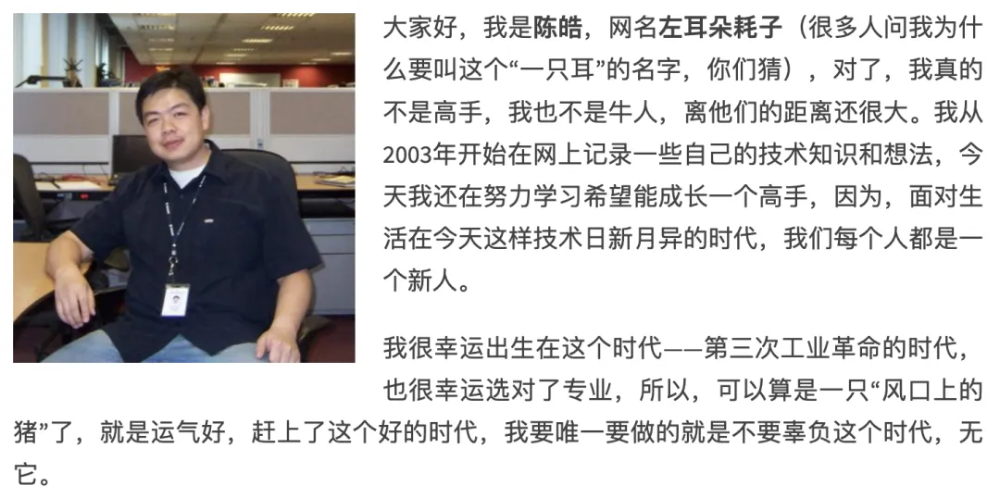

———纪念左耳朵耗子
<!--truncate-->

> 早上通勤路上，看到有文章提到耗子叔，便立马想起2年前耗子叔离世时，自己拟下的本文标题，却迟迟未动笔。
> 落笔之日，适逢耗子叔离世二周年。

## 与技术人的精神远游

最早接触左耳朵耗子，是在大学时间折腾 Linux 时，误打误撞访问到耗子叔的博客 CoolShell，当时便被耗子叔的技术才华所吸引，于是便一直关注。

大学毕业参加工作，圈子与认知都在不断发生变化，譬如技术圈子的人在彼时应该都用过或听过极客时间，而极客时间当时最为出名的便是耗子叔的专栏——《左耳听风》。

后来得知在此之前，耗子叔已有过相关著作《程序员的练级攻略》。

再后来与耗子叔有交集，是学习[浅谈 Prometheus 的数据存储](https://mp.weixin.qq.com/s/dakrue_Z8Nt5CD6NId_KZw)时，参考到耗子叔的创业公司 MegaEase 的[B站Up主视频](https://www.bilibili.com/video/BV1a64y1X7ys)。

**芝兰生于空谷，不以无人而不芳**。这是耗子叔的座右铭，也是他一生的写照。

耗子叔的博客文章从 2004年开始，到 2023年结束，整整 19年，作为一个技术人，能坚持如此长时间输出高质量内容，实属不易。反观自己，又能坚持到何时？

2023年惊闻耗子叔离世，当时便觉得惋惜，一个技术圈的传奇人物就这样离世了。在当今技术圈，像他这样既深耕技术又贴近现实的引路人，已然难觅踪影。这个时代从不缺乏励志故事和成功典范，但真正能体察普通工程师的困境，并指明切实可行路径的导师却寥寥无几。那些站在聚光灯下的成功人士，往往难以理解普通从业者面临的真实挑战，他们或许不曾体会过缺乏资源和支持的处境。

互联网时代信息泛滥，但经得起时间沉淀的内容屈指可数。耗子叔的诸多洞见，纵使岁月流转，依然能为后来者提供清晰的指引和持续的动力。他的文字如同技术人的精神坐标，无论何时重读，都能让人重新找到前行的方向。我想，技术人的生命价值或许在于：我们写的每一行代码，解决的每一个问题，分享的每一篇心得，都可能成为他人前进路上的垫脚石。就像耗子叔留给我们的精神遗产——那些深入浅出的技术解析，那些发人深省的职业思考，那些历经岁月仍熠熠生辉的真知灼见。

附上一个代码仓库[Remembering-Haoel](https://github.com/megaease/Remembering-Haoel)，记录了一些与耗子叔认识、打过交道的人和事。

## 生如夏花

耗子叔的离世，加上之前的疫情、以及这几年身边逝去的亲人，促使我不断思考生命的意义。当我们离开时，希望留下怎样的精神遗产？

这种思考并非为了迎合他人眼光，而是帮助我们厘清内心真正珍视的价值。

生命像一场无法回放的直播，没有彩排，没有重来。我们总以为来日方长，却忘了世事无常。那些计划中的旅行，那些想说却未说出口的话，那些被"等有空再说"推迟的相聚，都可能在某一个平凡的午后，永远失去实现的机会。

在日复一日的忙碌中，我们常常忘记生命最本真的模样。清晨的露珠，午后的蝉鸣，傍晚的晚霞，这些最平凡的自然馈赠，往往被我们视而不见。直到某天，当我们突然失去感受这些美好的能力时，才惊觉生命中最珍贵的，从来都不是那些我们拼命追逐的东西。

当我们终将离开时，带不走的不是名利与成就，而是那些曾经温暖过他人的时刻，那些让世界变得更美好的微小改变。“生如夏花之绚烂，死如秋叶之静美”。生命的意义不在于长度，而在于我们是否真正活出了自己的色彩。
