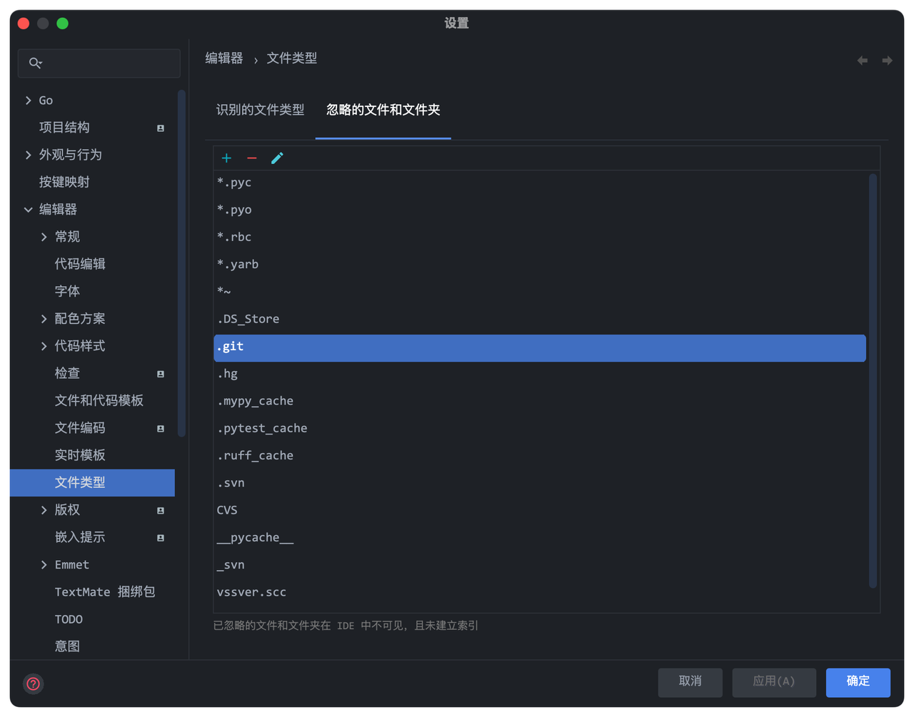

## 以Tab标签页形式打开多个项目

### 系统设置

### IDE设置

Preferences -> Apperance & Behavior -> System Settings -> Open Projects on starup【选择New Window】

设置完成后重启生效，最终效果

## 在项目结构中显示隐藏的.git目录

将.git目录从“忽略的文件和文件夹”中移除即可

